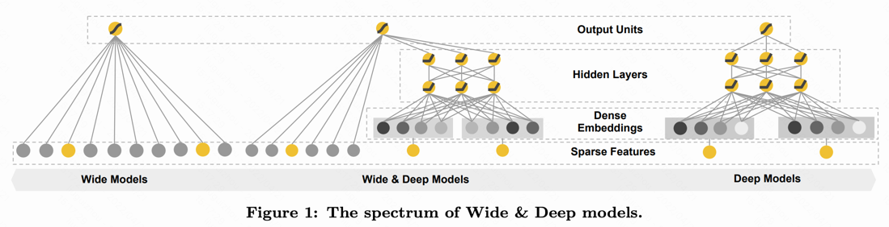

# 参考资料
- 综述类普及 & DeepCTR包（https://github.com/shenweichen/DeepCTR）

# 博客们

[1. 一文读懂CTR预估模型的发展历程(知乎)](https://zhuanlan.zhihu.com/p/465520407)
  
- 摘要：CTR预估是搜索、推荐、广告等领域基础且重要的任务，主要目标是预测用户在当前上下文环境下对某一个候选（视频、商品、广告等） 发生点击的概率。CTR预估从最原始的逻辑回归模型，发展到FM、深度学习模型等，经历了一个不断创新的过程，其核心为如何设计、融合不同的特征交叉方式。本文从FM和DNN开始开始，带你梳理CTR预估模型的发展历程，包括FNN、PNN、Wide&Deep、DCN、DeepFM、xDeepFM等一系列CTR预估模型和它们之间发展演进的关系。

- 关键词句：
  - 发展/创新的核心为如何设计、融合不同的特征交叉方式
  - FNN、PNN、Wide&Deep、DCN、DeepFM、xDeepFM

- (1) FM 和 DNN
  - FM：vector-wise特征交叉，即在每个特征向量的维度进行交叉
    - [论文](https://www.csie.ntu.edu.tw/~b97053/paper/Rendle2010FM.pdf) 
    - [知乎-FM（Factorization Machines）的理论与实践](https://zhuanlan.zhihu.com/p/50426292)
    - 优势
      - 在高度稀疏的情况下特征之间的交叉仍然能够估计，而且可以泛化到未被观察的交叉
      - 参数的学习和模型的预测的时间复杂度是线性的
    
  - DNN：bit-wise维度，即每个元素值交叉，不管这个值来自哪个特征
    - Embedding+DNN的思路。将每个特征通过Embedding矩阵转换成一个向量，将所有向量拼接到一起，通过多层DNN网络进行预测

- (2) 对于DNN和FM的模型优化

***FM和DNN的结合***

[Deep Learning over Multi-field Categorical Data – A Case Study on User Response Prediction（2016，FNN）](https://arxiv.org/pdf/1601.02376.pdf?ref=https://githubhelp.com)
将DNN和FM模型的优势进行了结合。该方法首先使用FM进行训练，得到每个特征对应的向量，作为每个特征的向量表示。然后使用这个向量作为每个特征的初始化向量，后面使用DNN进行预测

> **论文摘要**：
> 预测用户响应（例如点击率和转化率）在许多 Web 应用程序（包括 Web 搜索、个性化推荐和在线广告）中至关重要。
> 与我们通常在图像和音频领域中发现的连续原始特征不同，网络空间中的输入特征始终是多领域的，并且大多是离散的和分类的，而它们的依赖关系鲜为人知。 
> 
> 主要的用户响应预测模型要么将自己限制为线性模型，要么需要手动构建高阶组合特征。前者失去了探索特征交互的能力，而后者导致在大特征空间中的大量计算。
> 为了解决这个问题，我们提出了两个新模型，使用深度神经网络 (DNN) 从分类特征交互中自动学习有效模式并预测用户的广告点击。
> 
> 为了让我们的 DNN 高效工作，我们建议利用三种特征转换方法，即因子分解机 (FM)、受限玻尔兹曼机 (RBM) 和去噪自动编码器 (DAE)。本文介绍了我们模型的结构及其有效的训练算法。真实世界数据的大规模实验表明，我们的方法比主要的最先进模型效果更好
> 
> **Conclusion**：在本文中，我们研究了训练深度神经网络 (DNN) 以基于多领域分类特征预测用户的广告点击响应的潜力。为了解决高维离散分类特征的计算复杂性问题，我们提出了两种 DNN 模型：带监督分解机预训练的场特征嵌入，以及基于场采样的 RBM 和 DAE 无监督相关的全连接 DNN .

[Product-based Neural Networks for User Response Prediction（2016，PNN）](https://arxiv.org/pdf/1807.00311.pdf)
对该方法进行了改进，不再使用FM预训练得到向量，而是对每个特征的向量随机初始化，对DNN模型进行修改。在DNN模型中引入了FM的思想，对每两个embedding pair进行内积或外积运算，相当于FM中的二阶特征交叉这一步，再把一阶和二阶特征拼接到一起，后面使用全连接层进行CTR预测。

> **论文摘要**：
> 用户响应预测是个性化信息检索和过滤场景的重要组成部分，例如推荐系统和网络搜索。 
> 
> 用户响应预测中的数据大多采用多字段分类格式，并通过 one-hot 编码转换为稀疏表示。由于表示和优化中的稀疏性问题，大多数研究都集中在特征工程和浅层建模上。最近，深度神经网络因其高容量和端到端的训练方案而引起了对此类问题的研究关注。
> 
>在本文中，我们研究了点击预测场景下的用户响应预测。我们首先分析基于潜在向量的模型中的耦合梯度问题，并提出核积来学习场感知特征交互。然后，我们讨论了基于 DNN 的模型中不敏感的梯度问题，并提出了基于乘积的神经网络 (PNN)，它采用特征提取器来探索特征交互。将内核产品推广到 net-in-net 架构，我们进一步提出 Product-network In Network (PIN)，它可以推广以前的模型。对 4 个工业数据集和 1 个竞赛数据集的广泛实验表明，我们的模型在 AUC 和日志损失方面始终优于 8 个基线。此外，PIN 在在线 A/B 测试中的 CTR 提升很大（相对 34.67%）。

FNN和PNN的问题在于，由于采用了DNN结构，模型更倾向于提取高阶特征交叉，对低阶特征交叉提取较少，而后者在CTR预估中也是非常重要的。

[DeepFM: A Factorization-Machine based Neural Network for CTR Prediction（2017）](https://arxiv.org/pdf/1703.04247.pdf)
提出DeepFM模型，通过结合DNN和FM实现二者优势互补。模型分为DNN模块和FM模块，`DNN模块和FM模块共享底层embedding（Q：这个怎么来的？）`。Deep模块和FM模块的输出最终拼接到一起，共同预测点击率。

> **论文摘要**： 
> 学习用户行为背后的复杂特征交互对于最大化推荐系统的 CTR 至关重要。 尽管取得了很大进展，但现有方法似乎对低阶或高阶交互有强烈的偏见，或者需要专业的特征工程。 
>
> 在本文中，我们表明可以推导出一个强调低阶和高阶特征交互的端到端学习模型。 所提出的模型 DeepFM 在新的神经网络架构中结合了用于推荐的分解机器和用于特征学习的深度学习的强大功能。
> 
> 与谷歌最新的 Wide & Deep 模型相比，DeepFM 的“wide”和“deep”部分具有共享输入，除了原始特征之外不需要特征工程。 进行了综合实验以证明 DeepFM 在基准数据和商业数据上优于现有 CTR 预测模型的有效性和效率

***针对DNN/FM问题的改进***

DNN或者FM模型都是基于embedding的，FM中的embedding是每个特征对应的向量，DNN中的embedding是每个特征值对应的向量。
- 基于embedding的方法虽然提升了模型的泛化性（generalization），但是记忆性（memorization）较弱：
  - 例如，对于某个user+某个item这种组合特征，一种处理方法是userid+itemid组成新的id，另一种方式是userid的embedding和itemid的embedding做内积。前者是id特征，记忆性要明显强于后者，而前者的泛化性较弱，例如训练样本中没有这个user和这个item的组合。
  - id特征：记忆性强于emb组合，但泛化性较弱（比如没有该user-id出现时）

[Wide & Deep Learning for Recommender Systems（2016，Wide&Deep）](https://arxiv.org/pdf/1606.07792.pdf)
提出了在DNN的基础上，添加wide结构：

- DNN负责泛化性
- wide负责记忆性
- 缺点在于左侧的wide部分依赖人工设计特征

[Deep & Cross Network for Ad Click Predictions（2017，DCN）](https://arxiv.org/pdf/1708.05123.pdf) 将左侧的wide部分替换成了cross layer ，随着层数的增加，最终cross部分的输出是所有特征的多阶交叉，且交叉的阶数和cross layer的层数线性相关。通过这种方式，实现了对所有特征交叉的自动化学习，而不再需要手动提取高阶交叉特征了。

$x_{l+1} = x_{0} x_{l}^{T} w_{l} + b_{l} + x_{l} = f(x_{l}, w_{l}, b_{l}) + x_{l}$

从该公式可以看出，每一层的计算都依赖上一层，并且保留信息，达到所有特征交叉的效果。
