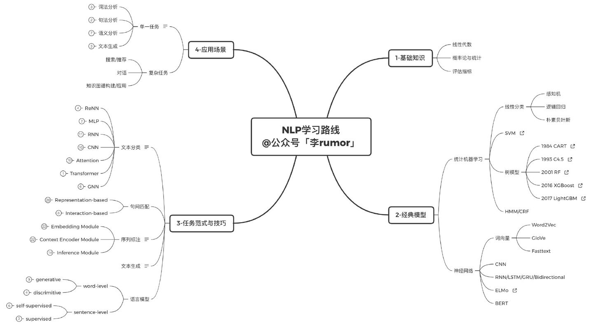
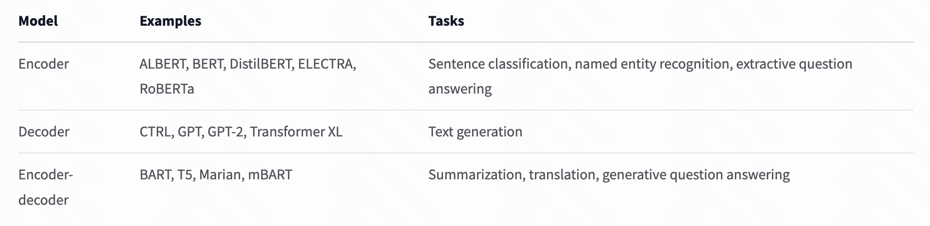
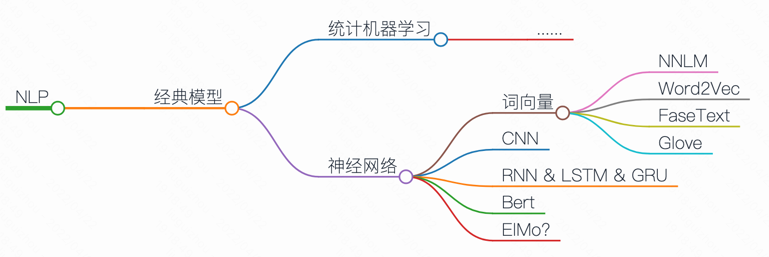
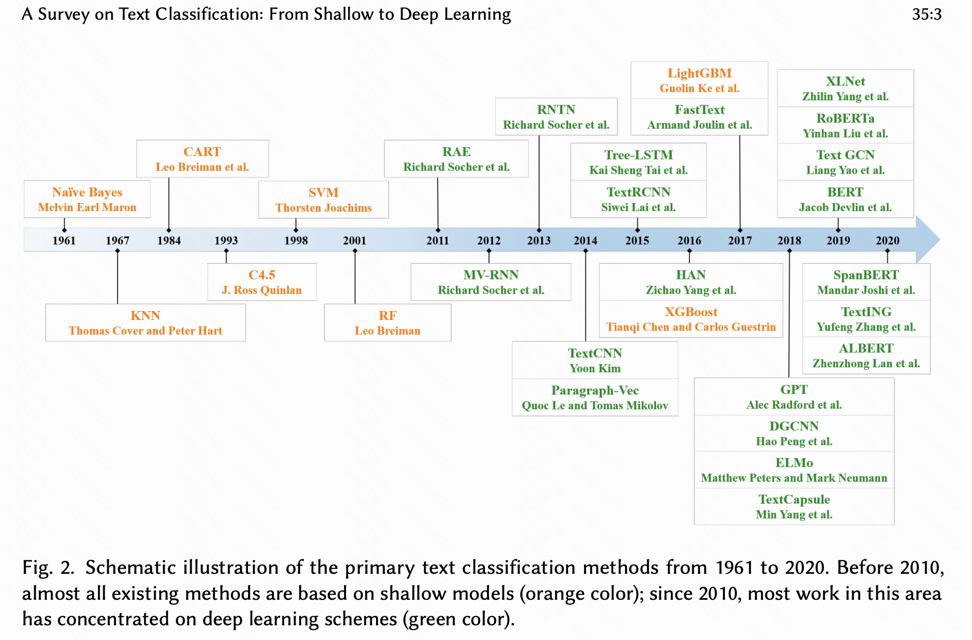
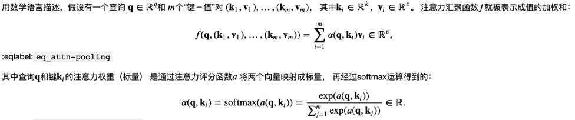

# 深度学习 - NLP部分

# 目的
该project有若干目的：
- 1. 归纳任务范式下主要的模型、论文、数据集等
- 2. 梳理模型概念、算法、细节，给出项目实现
- 3. 归纳发展历史

# 0.参考来源

- 核心参考
  - hugging-face 
    - [官网](https://huggingface.co/)
    - [notebooks](https://huggingface.co/docs/transformers/v4.20.0/en/notebooks)
    - [course](https://huggingface.co/course/chapter2/2?fw=pt)
    - [transformer](https://huggingface.co/docs/transformers/model_doc/albert#transformers.AlbertForTokenClassification)
  - 中文预训练
    - [bert-wwm](https://github.com/ymcui/Chinese-BERT-wwm)
  - pytorch 
    - [torchtext，含有数据集](https://github.com/pytorch/text)
  - [bert可视化](https://huggingface.co/exbert/?model=bert-large-uncased&modelKind=bidirectional&sentence=Do%20not%20meddle%20in%20the%20affairs%20of%20wizards,%20for%20they%20are%20subtle%20and%20quick%20to%20anger.&layer=0&heads=..0,1,2,3,4,5,6,7,8,9,10,11,12,13,14,15&threshold=0.36&tokenInd=null&tokenSide=null&maskInds=..&hideClsSep=true)
  - [torchtext-dataset](https://pytorch.org/text/stable/datasets.html)

- 学术论文 / 学会
  - [ACL-Annual Meeting of the Association for Computational Linguistics `选择ACL为语言模型`](https://aclanthology.org/)
  - [EMNLP - 2020](https://2020.emnlp.org/papers/main)
    


- 一些博客参考
  
  - [rumor - 如何系统性地学习NLP 自然语言处理？ - `关注里面对综述的引用`](https://www.zhihu.com/question/27529154/answer/1643865710)
    - [NLP快速入门路线及任务详解 - `其他综述`](https://mp.weixin.qq.com/s/zrziuFLRvbG8axG48QpFvg)
    - [深度学习文本分类｜模型&代码&技巧](https://mp.weixin.qq.com/s?__biz=MzAxMTk4NDkwNw==&mid=2247485854&idx=1&sn=040d51b0424bdee66f96d63d4ecfbe7e&chksm=9bb980faacce09ec069afa79c903b1e3a5c0d3679c41092e16b2fdd6949aa059883474d0c2af&token=1473678595&lang=zh_CN&scene=21#wechat_redirect)
  - [nlp-tutorial](https://github.com/graykode/nlp-tutorial)
  - [非常牛逼的nlp_course！！！](https://github.com/yandexdataschool/nlp_course)
  - [nlp-roadmap](https://github.com/graykode/nlp-roadmap)
  - [Transformers-大集合](https://github.com/huggingface/transformers)
  - [个人博客1](https://wmathor.com/index.php/archives/1399/)
  - [自然语言处理入门-一些名词和概念](http://www.fanyeong.com/2018/02/13/introduction_to_nlp/)
  - [Archive | Deep Learning for Natural Language Processing](https://machinelearningmastery.com/category/natural-language-processing/)
  - [NLP101-github](https://github.com/Huffon/NLP101)
  - [text-classification](https://github.com/zhengwsh/text-classification)
  - [meta-research](https://github.com/orgs/facebookresearch/repositories?q=&type=all&language=python&sort=)
  - [美团nlp](https://tech.meituan.com/tags/nlp.html)

# 1. 任务范式-划分

主题识别、关键词提取、实体挖掘、文本检索、内容生成、精彩片段识别、情感分析

> 
> 引用自【自然语言处理怎么最快入门？ - 李rumor的回答 - 知乎】
https://www.zhihu.com/question/19895141/answer/1650139426

paperswithcode
- NLP：https://paperswithcode.com/area/natural-language-processing
- Sentence Pair Modeling：https://paperswithcode.com/task/sentence-pair-modeling
- Sentiment Analysis：https://paperswithcode.com/task/sentiment-analysis

## 文本分类
 

## 序列标注
综述见 paper-reading 笔记

1.综述[ A Survey on Recent Advances in Sequence Labeling from Deep Learning Models](https://arxiv.org/pdf/2011.06727.pdf)
｜ [笔记](https://github.com/Iven2166/models-learning/blob/main/paper-reading/nlp-survey-sequence-labeling.md)

2.综述[A Survey on Deep Learning for Named Entity Recognition](https://arxiv.org/abs/1812.09449)
｜ [笔记](https://github.com/Iven2166/models-learning/blob/main/paper-reading/nlp-survey-on-deep-learning-for-ner.md)            

3.对字符级别的模型 [Learning Character-level Representations for Part-of-Speech Tagging](http://proceedings.mlr.press/v32/santos14.pdf)


深度学习含有几个架构：
1. Input encoder: 涉及到输入的表示，word-、token-、character-emb
2. Context encoder: 上下文的表示，捕捉上下文对于产生label的依赖关系，RNN、LSTM、CNN、Transformer
3. Tag decoder: 可能直接产生label（比如softmax），或者建立label之间的依赖关系（CRF、RNN、Pointer Networks([1](https://zhuanlan.zhihu.com/p/48959800) / [2](https://hyperscience.com/tech-blog/power-of-pointer-networks/) ）

经典问题
1. 实体嵌套

经典数据集

指标：acc、recall、F1

## 主题识别

## 关键词提取

统计方法模型

深度学习模型

## 实体识别
baseline： lstm + crf

- [知乎-BiLSTM上的CRF，用命名实体识别任务来解释CRF（一）](https://zhuanlan.zhihu.com/p/119254570)
- [wx-缺少训练样本怎么做实体识别？小样本下的NER解决方法汇总](https://mp.weixin.qq.com/s/FH1cWxXlTFt0RdEipSJH1w)


## 内容生成

## 文本匹配

### 语义相似度

#### 数据集
- 中文自然语言推理与语义相似度数据集：https://github.com/zejunwang1/CSTS

## 文本翻译

### 到目前的理解

- seq2seq
  - 经典架构，包含encoder和decoder，最开始是用RNN系列模型。输入一个序列，encoder对input序列进行编码，得到隐藏的（浓缩）信息，到decoder进行解码。
  - seq2seq还可以应用在问答（本质也是根据提问的输入来获得最大概率的回答）
- attention
  - 注意力机制，用于进行对齐，目的是让decoder产出翻译序列时，能够知道当下应该注意input序列里的哪个词，从而进行"软"对齐。
- 评价机制
  - BLEU分数

### 项目实现

#### 项目1：pytorch翻译

- 原文：https://pytorch.org/tutorials/intermediate/seq2seq_translation_tutorial.html#the-decoder


### 论文及其它参考
- 论文
  - Sequence to Sequence Learning with Neural Networks：https://arxiv.org/abs/1409.3215 ｜ 笔记
  - Neural Machine Translation by Jointly Learning to Align and Translate：https://arxiv.org/abs/1409.0473 ｜ 笔记   
  - A Neural Conversational Model：https://arxiv.org/abs/1506.05869 | 笔记
  - `local attention` Effective Approaches to Attention-based Neural Machine Translation: https://arxiv.org/abs/1508.04025 | 笔记
  
- 课程及其他
  - cs224n课程-[翻译部分笔记](https://github.com/Iven2166/models-learning/blob/main/paper-reading/cs224n_notes/cs224n-2019-notes06-NMT_seq2seq_attention.md)


## 数据增强

- https://amitness.com/2020/05/data-augmentation-for-nlp/
- 中文数据增强：
  - https://github.com/425776024/nlpcda
  - https://zhuanlan.zhihu.com/p/161947528


*任务（hugging face）*

- sequence classification
- Token classification
  - Named entity recognition (NER)：命名实体识别
  - Part-of-speech tagging (POS)：词性标注
- masked language model：完形填空、预测
- Translation
- Summarization - 
  - Extractive summarization：抽取式（从文中直接抽取关键词句）
  - Abstractive summarization：摘要式（人类会理解上下文、语义等来创造摘要）

*模型*

Summarization 摘要 + 关键词抽取
- 统计学习方法 [参考1](https://www.163.com/dy/article/GKB4GH1U0531D9VR.html)
  - TF-IDF [代码实现参考](https://www.cnblogs.com/Micang/p/10366954.html)
  - Text Rank：extractive and unsupervised 


*参考*
- 文本摘要使用的模型：https://medium.com/codex/long-story-short-an-nlp-use-case-on-text-summarization-2752a7daa5f7

[transformers可用的任务](https://huggingface.co/course/chapter1/9?fw=pt)



  
## 发展历史整体感知
从`综述`、博客不断积累，自己整理出整体发展的历史，再逐个掌握



```markdown 
-- https://markmap.js.org/repl
# NLP
## 经典模型

### 统计机器学习
#### ......

### 神经网络
#### 词向量
##### NNLM
##### Word2Vec
##### FaseText
##### Glove
#### CNN
#### RNN & LSTM & GRU
#### Bert 
#### ElMo?
```

综述1:
[2020 A Survey on Text Classification: From Shallow to Deep Learning](https://arxiv.org/pdf/2008.00364v2.pdf)



## 常见指标

### 损失函数

### 困惑度（Perplexity)

参考：
- https://www.topbots.com/perplexity-and-entropy-in-nlp/
- NLP课件
  - https://courses.cs.washington.edu/courses/csep517/18au/
  - page7： http://www.cs.columbia.edu/~mcollins/courses/nlp2011/notes/lm.pdf

# 2. 算法模型

## TextCNN

重要参考

| type 	| name                                                                                                             	| intro                                                                         	| link                                  	|
|------	|-------------------------------------------------	|-------------------------------------------------	|----------------	|
| 原作 	| 2014-Convolutional Neural Networks for Sentence Classification                                                         	| (1) CNN-random-init <br> (2)CNN-static <br> (3)CNN-non-static <br> (4)CNN-multichannel 	| [link](https://aclanthology.org/D14-1181.pdf) 	|
| 衍生解读1 	| 2016-A Sensitivity Analysis of (and Practitioners’ Guide to) Convolutional Neural Networks for Sentence Classification 	|                                                                                        	| [link](https://arxiv.org/pdf/1510.03820.pdf)  	|
| 我的记录 |[TextCNN-readme.md](/TextCNN/TextCNN-readme.md)||
| 我的代码复现 |jupyter文件|||


## RNN

rnn-learn.md


## fastText 

- 官方参考
  - 官方：https://fasttext.cc/
  - git：https://github.com/facebookresearch/fastText
  - 官方-文本分类：https://fasttext.cc/docs/en/supervised-tutorial.html
  - FAQ：https://fasttext.cc/docs/en/faqs.html
    - reduce the size of my fastText models
- 论文
  - 原作(2016)：https://arxiv.org/pdf/1607.01759.pdf 
    - 实验数据：1  Sentiment analysis 2 tag predictions（有多个tag的情况）
  
> A simple and efficient baseline for sentence classification is to represent sentences as bag of words (BoW) and train a linear classifier, e.g., a logistic regression or an SVM (Joachims, 1998; Fan et al., 2008). However, linear classifiers do not share parameters among features and classes. This possibly limits their generalization in the context of large output space where some classes have very few examples. Common solutions to this problem are to factorize the linear classifier into low rank matrices (Schutze, 1992; Mikolov et al., 2013) or to use multilayer neural networks (Collobert and Weston, 2008; Zhang et al., 2015).
>
> 句子分类的一个简单有效的基线是将句子表示为词袋 (BoW) 并训练线性分类器，例如逻辑回归或 SVM (Joachims, 1998; Fan et al., 2008)。 然而，线性分类器不共享特征和类之间的参数。 这可能会限制它们在大输出空间的上下文中的泛化，其中某些类的示例很少。 这个问题的常见解决方案是将线性分类器分解为低秩矩阵（Schutze，1992；Mikolov 等人，2013）或使用多层神经网络（Collobert 和 Weston，2008；Zhang 等人，2015）。


## Bert

- Bert论文：https://arxiv.org/abs/1810.04805


## ElMo


## NNLM
  - 论文:  https://www.jmlr.org/papers/volume3/bengio03a/bengio03a.pdf 
  - 论文解读: https://www.jianshu.com/p/be242ed3f314
  - [!!! NNLM 的 PyTorch 实现](https://wmathor.com/index.php/archives/1442/)


## Word Embedding 词嵌入

[预训练技术在美团到店搜索广告中的应用](https://tech.meituan.com/2021/12/02/application-of-pre-training-technology-in-meituan-search-ads.html)

`word2vec, fastText, Glove, Bert`

概念上而言，它是指把一个维数为所有词的数量的高维空间嵌入到一个维数低得多的连续向量空间中，每个单词或词组被映射为实数域上的向量。
[wiki](https://zh.wikipedia.org/wiki/%E8%AF%8D%E5%B5%8C%E5%85%A5)

特点
- 高维度转低维度表示：单词个数 |V| (one-hot) 转化为指定维度
- 词汇之间能够表示相似度
- 向量的每一维没有含义

文本表示有哪些方法？
- 基于one-hot、tf-idf、textrank等的bag-of-words 
  - 维度灾难
  - 语义鸿沟
- 主题模型：LSA（SVD）、pLSA、LDA
  - 计算量复杂
- 基于词向量的固定表征：word2vec、fastText、glove
  - 相同上下文语境的词有似含义
  - 固定表征无法表示"一词多义"（因为一个单词只有一个emb？）
- 基于词向量的动态表征：elmo、GPT、bert

单个介绍
- word2vec(2013)
  - 论文：
    - 原作者-[word2vec思想](https://arxiv.org/pdf/1301.3781.pdf) (也讨论了和NNLM等的区别)
    - 原作者-Skip-gram模型的两个策略：[Hierarchical Softmax 和 Negative Sampling](https://papers.nips.cc/paper/2013/file/9aa42b31882ec039965f3c4923ce901b-Paper.pdf)
    - 原作者的[博士论文（2012），适合用于了解历史](https://www.fit.vut.cz/study/phd-thesis-file/283/283.pdf)
    - 其他作者解读
      - [word2vec Parameter Learning Explained](https://arxiv.org/pdf/1411.2738.pdf)
      - [word2vec Explained: Deriving Mikolov et al.’s Negative-Sampling Word-Embedding Method](https://arxiv.org/pdf/1402.3722.pdf)
  - 要点
    - Huffman Tree 霍夫曼二叉树：权值更高的离树越近
  - 博客参考：
    - [word2vec原理(一) CBOW与Skip-Gram模型基础](https://www.cnblogs.com/pinard/p/7160330.html)
    - [word2vec原理(二) 基于Hierarchical Softmax的模型](https://www.cnblogs.com/pinard/p/7243513.html)
    
  - 其实word2vec和Co-Occurrence Vector的思想是很相似的，都是基于一个统计学上的假设：经常在同一个上下文出现的单词是相似的。只是他们的实现方式是不一样的，前者是采用词频统计，降维，矩阵分解等确定性技术；而后者则采用了神经网络进行不确定预测，它的提出主要是采用神经网络之后计算复杂度和最终效果都比之前的模型要好。所以那篇文章的标题才叫：Efficient Estimation of Word Representations in Vector Space。[参考](http://www.fanyeong.com/2017/10/10/word2vec/) 


- Glove
  - [原论文](https://nlp.stanford.edu/pubs/glove.pdf)
  - [官网](https://nlp.stanford.edu/projects/glove/)
  - [git](https://github.com/stanfordnlp/GloVe)
  

预训练

- [不错的博主](https://github.com/loujie0822/Pre-trained-Models)
  - [NLP算法面试必备！PTMs：NLP预训练模型的全面总结](https://zhuanlan.zhihu.com/p/115014536)
  - [nlp中的词向量对比：word2vec/glove/fastText/elmo/GPT/bert](https://zhuanlan.zhihu.com/p/56382372)
  - [nlp中的预训练语言模型总结(单向模型、BERT系列模型、XLNet)](https://zhuanlan.zhihu.com/p/76912493)
- [Glove详解](http://www.fanyeong.com/2018/02/19/glove-in-detail/#comment-1462)
- [神经网络语言模型(NNLM)](https://blog.csdn.net/u010089444/article/details/52624964)

- [NLP必读 | 十分钟读懂谷歌BERT模型](https://www.jianshu.com/p/4dbdb5ab959b)
- [Transformer-论文解读](https://www.jianshu.com/p/4b1bcd5c5f80)


## Transfomer系列

[历史介绍](https://huggingface.co/course/en/chapter1/4?fw=pt#a-bit-of-transformer-history)

| 进程     | 论文    | 
| :------------- | :------------- | 
| 概念提出      | 在人工智能领域,注意力这一概念最早是在计算机视觉中提出，用来提取图像特征．[[Itti et al., 1998](https://www.cse.psu.edu/~rtc12/CSE597E/papers/Itti_etal98pami.pdf) ]提出了一种自下而上的注意力模型． 该模型通过提取局部的低级视觉特征，得到一些潜在的显著（salient）区域．      | 
| 图像分类      | 在神经网络中， [[Mnih et al., 2014](https://arxiv.org/pdf/1406.6247.pdf) ]在循环神经网络模型上使用了注意力机制来进行图像分类．     | 
| 机器翻译      | [[Bahdanau et al., 2014](https://arxiv.org/pdf/1409.0473.pdf) ]使用注意力机制在机器翻译任务上将翻译和对齐同时进行．     | 
| attention is all you need      | 目前， 注意力机制已经在语音识别、图像标题生成、阅读理解、文本分类、机器 翻译等多个任务上取得了很好的效果， 也变得越来越流行． 注意力机制的一个重 要应用是自注意力． 自注意力可以作为神经网络中的一层来使用， 有效地建模长 距离依赖问题 [[Attention is all you need, Vaswani et al., 2017](https://arxiv.org/pdf/1706.03762.pdf) ]     | 

### 基础知识

注意力 

[参考：10.1. 注意力提示](https://zh-v2.d2l.ai/chapter_attention-mechanisms/attention-cues.html)

参数化全连接层、非参数化的pooling，都是提取该区域最大或者平均的特征，相当于被迫纳入了提示（在草丛中看到红色花朵）。
>首先，考虑一个相对简单的状况， 即只使用非自主性提示。 要想将选择偏向于感官输入， 我们可以简单地使用参数化的全连接层， 甚至是非参数化的最大汇聚层或平均汇聚层。“是否包含自主性提示”将注意力机制与全连接层或汇聚层区别开来。 在注意力机制的背景下，我们将自主性提示称为查询（query）。 给定任何查询，注意力机制通过注意力汇聚（attention pooling） 将选择引导至感官输入（sensory inputs，例如中间特征表示）。 在注意力机制中，这些感官输入被称为值（value）。 更通俗的解释，每个值都与一个键（key）配对， 这可以想象为感官输入的非自主提示。 如 图10.1.3所示，我们可以设计注意力汇聚， 以便给定的查询（自主性提示）可以与键（非自主性提示）进行匹配， 这将引导得出最匹配的值（感官输入）。

注意力评分函数

[参考：10.3. 注意力评分函数](https://zh-v2.d2l.ai/chapter_attention-mechanisms/attention-scoring-functions.html)

- 掩蔽softmax操作
- 加性注意力
- 缩放点积注意力

小结：
- 将注意力汇聚的输出计算可以作为值的加权平均，选择不同的注意力评分函数会带来不同的注意力汇聚操作。
- 当查询和键是不同长度的矢量时，可以使用可加性注意力评分函数。当它们的长度相同时，使用缩放的“点－积”注意力评分函数的计算效率更高。

在这个教程里，体现了查询q，在注意力里面和 键-值的计算关系。特别地，在代码里，扩展到了高维度的计算方法。（不太好懂，需要反复看代码 print(shape) ）



课后qa：
- masked_softmax的作用：比如，在句子不够长时（4 out of 10），padding填充了6个。那么拿到query时，要看键值，此时仅需要看前4个，后6个没有意义。

参考：
- [知乎-transformer解析和实现](https://zhuanlan.zhihu.com/p/420820453)


## 面试相关

- [NLP算法-面经](https://cloud.tencent.com/developer/article/1817838)
- 感觉整体整理的目录不错：https://createmomo.github.io/2018/01/23/Super-Machine-Learning-Revision-Notes/#tableofcontents
- NLP岗位八股文：https://zhuanlan.zhihu.com/p/470674031
- 一文搞懂NLP中的词向量: https://www.easemob.com/news/5370
- 面试记录
  - https://www.cvmart.net/community/detail/6234、
  - https://cloud.tencent.com/developer/article/1499377?from=article.detail.1958292
  - https://zhuanlan.zhihu.com/p/247599441
- [Transformer、BERT细节基础知识点](https://cloud.tencent.com/developer/article/1981488)