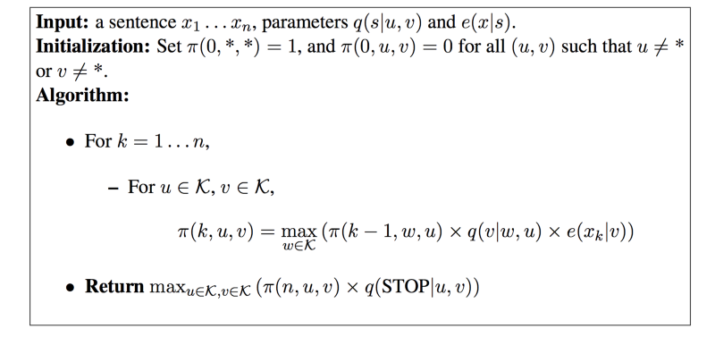
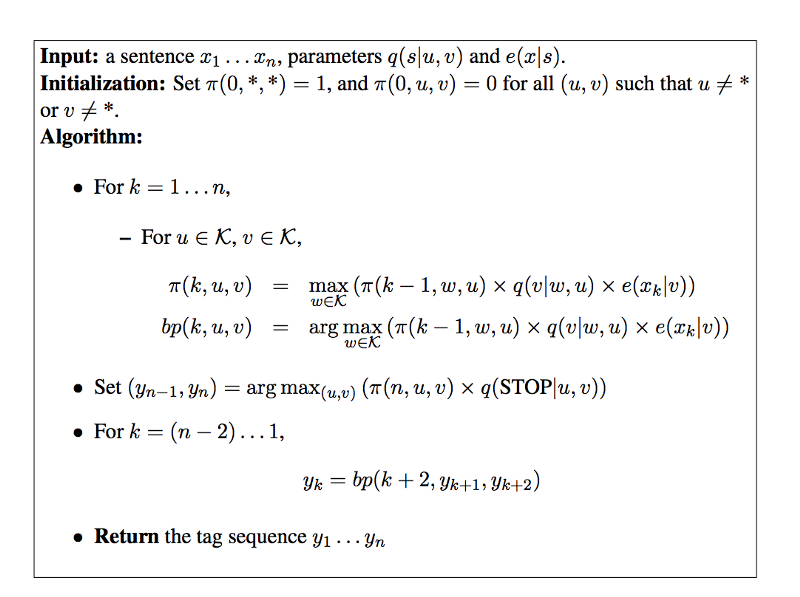

NER

- 1. 无监督关键词提取
    - a. 描述：不需要人工标注语料，通过统计学方法发现较为重要的词作为关键词。
    - b. 方法：TF-IDF、TextRank、LDA
        - i. 基于统计特征的关键词提取（TF,TF-IDF）
        - ii. 基于词图模型的关键词提取(PageRank,TextRank)
        - iii. 基于主题模型的关键词提取(LDA)
- 2. 有监督关键词提取方法
    - a. 描述1：将关键词抽取过程视为二分类问题，先提取出候选词，然后对于每个候选词划定标签，要么是关键词，要么不是关键词，然后训练关键词抽取分类器。
    - b. 描述2：基于时序序列模型（LSTM）、Bert（transformer-encoder）学习特征，结合CRF条件随机场进行预测。

参考：
- 知乎NER话题：https://www.zhihu.com/topic/19648557/top-answers
- [POS的 Vitebi 算法](https://www.freecodecamp.org/news/a-deep-dive-into-part-of-speech-tagging-using-viterbi-algorithm-17c8de32e8bc/)

> $q(s|u,v)$ 是转移(transition)概率，表示在状态$u,v$连续出现后，状态$s$出现的概率 $q(s|u,v)=c(u,v,s)/c(u,v)$ (有顺序的)
> 
> $e(x|s)$ 是发射emission函数，表示在状态$s$下，观察$x$出现的概率，一般 $e(x|s)=c(x,s) / c(s)$
> 
> 这里面的$c(~)$都是count函数，$//*, //*$是在句子之前的两个标志符，表示初始状态。在这里，是 trigram 模型，因此只有三个状态依赖关系的方程。
>
> 
> 
> 

