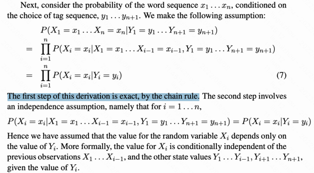
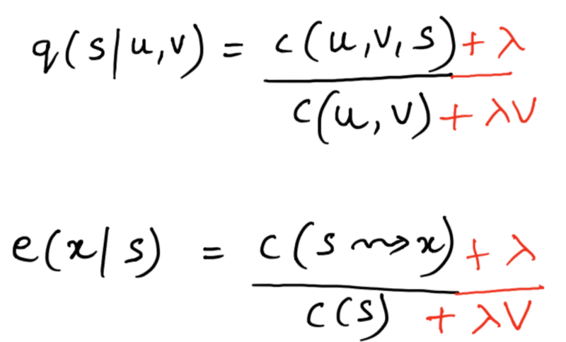
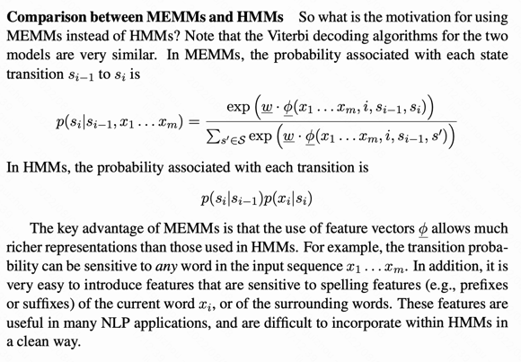

# NER

## 从读好论文和code开始

- [CoNLL-2003论文及code合集：感觉是非常好的找论文方法，通过项目star来筛选](https://paperswithcode.com/dataset/conll-2003)
    - [Semi-Supervised Sequence Modeling with Cross-View Training](https://paperswithcode.com/paper/semi-supervised-sequence-modeling-with-cross)
    
- [pengjun xie论文](https://aclanthology.org/people/p/pengjun-xie/)
- [CoNLL 2003EN榜单](https://paperswithcode.com/sota/named-entity-recognition-ner-on-conll-2003?p=automated-concatenation-of-embeddings-for-1)
  --- [ACL 2021, Automated Concatenation of Embeddings for Structured Prediction](https://arxiv.org/abs/2010.05006)
    - github:
- [EMNLP 2020, More Embeddings, Better Sequence Labelers?](https://aclanthology.org/2020.findings-emnlp.356/)
- [ACL 2021, Improving Named Entity Recognition by External Context Retrieving and Cooperative Learning](https://arxiv.org/abs/2105.03654)

- SemEval 2022, DAMO-NLP at SemEval-2022 Task 11: A Knowledge-based System for Multilingual Named Entity Recognition

- [达摩院语言实验室论文](https://damo.alibaba.com/labs/language-technology/)
- 一些大神：https://wangxinyu0922.github.io/cv/、http://jiangyong.site/

- [ACL 2021 Automated Concatenation of Embeddings for Structured Prediction](https://arxiv.org/abs/2010.05006)
    - [CoNLL 2003EN榜单](https://paperswithcode.com/sota/named-entity-recognition-ner-on-conll-2003?p=automated-concatenation-of-embeddings-for-1)
    - [gibhub](https://github.com/Alibaba-NLP/ACE)
    - [笔记](https://github.com/Iven2166/models-learning/blob/main/paper-reading/nlp-2021-ACL-Automated-Concatenation-of-Embeddings-for-Structured-Prediction.md)
    - 主要方向：寻找 concat embeddings 最佳结构，利用强化学习

## 杂

- 1. 无监督关键词提取
    - a. 描述：不需要人工标注语料，通过统计学方法发现较为重要的词作为关键词。
    - b. 方法：TF-IDF、TextRank、LDA
        - i. 基于统计特征的关键词提取（TF,TF-IDF）
        - ii. 基于词图模型的关键词提取(PageRank,TextRank)
        - iii. 基于主题模型的关键词提取(LDA)
- 2. 有监督关键词提取方法
    - a. 描述1：将关键词抽取过程视为二分类问题，先提取出候选词，然后对于每个候选词划定标签，要么是关键词，要么不是关键词，然后训练关键词抽取分类器。
    - b. 描述2：基于时序序列模型（LSTM）、Bert（transformer-encoder）学习特征，结合CRF条件随机场进行预测。

## HMM, CRF 合集

- 知乎NER话题：https://www.zhihu.com/topic/19648557/top-answers
- [cs4705-有关POS的课程集合](http://www.cs.columbia.edu/~cs4705/)
- [cs课程-HMM介绍（清晰明了）](http://www.cs.columbia.edu/~mcollins/courses/nlp2011/notes/hmms.pdf)
- [CRF的原理介绍-学习函数推导](https://www.cnblogs.com/weilonghu/p/11960984.html)
- [全网最详细的CRF算法讲解 - 水孕冰的文章 - 知乎](https://zhuanlan.zhihu.com/p/483820319)
- https://www.cnblogs.com/pinard/p/7068574.html
- http://blog.echen.me/2012/01/03/introduction-to-conditional-random-fields/
- 代码层面
    - [使用pytorch处理不同长度序列](https://www.jianshu.com/p/376c16b71130) `多对多的任务与多对一任务非常重要的一点不同就是，多对多任务一般是使用每个时序状态的输出作为输出与target计算loss，而多对一则一般是通过最后的hidden层来计算loss。在多对一的文本分类任务中，这个hidden可以看作是前面所有输入语句总结出来的语义信息，也即模型提取出来的语句语义特征，用于后续计算分类。`
    - [RNN在变长序列上处理问题](https://blog.csdn.net/zwqjoy/article/details/95050794)
    

HMM的两个重要假定： 

> （1）马尔可夫假设（状态构成一阶马尔可夫链），trigram的HMM中，$Y _{i}$仅依赖$Y _{i-1}$与$Y _{i-2}$
> 
> （2）输出独立性假设（输出仅与当前状态有关），随机变量 $X _{i}$仅依赖于 $Y _{i}$
> 
> 链式法则
> 
> 

- [HMM Vitebi 算法（与课程相同，加入了案例数据）](https://www.freecodecamp.org/news/a-deep-dive-into-part-of-speech-tagging-using-viterbi-algorithm-17c8de32e8bc/)

目的是计算整体 label（状态）的最大概率，也就是选取一条最大可能的路径。Vitebi算法应用动态规划的思想，求解。

> $q(s|u,v)$ 是转移(transition)概率，表示在状态$u,v$连续出现后，状态$s$出现的概率 $q(s|u,v)=c(u,v,s)/c(u,v)$ (有顺序的)
> 
> $e(x|s)$ 是发射emission函数，表示在状态$s$下，观察$x$出现的概率，一般 $e(x|s)=c(x,s) / c(s)$
> 
> $k$ 是序列的长度， $/pi$ 函数指的是长度为 $k$ 的序列的概率
> 
> 这里面的$c(...)$都是count函数，*, * 是在句子之前的两个标志符，表示初始状态。在这里，是 trigram 模型，因此只有三个状态依赖关系的方程。
>
> 
> 
> 增加的 bp 函数，是为了找到当下的最大可能的 状态($v$) 和 观察值($w$)在此为单词。
> 
> 
>
> 增加正则化，让测试集无法出现的样例能够得到函数的值。
> 
> 

- 代码实现1[Building a Named Entity Recognition model using a BiLSTM-CRF network](https://www.dominodatalab.com/blog/named-entity-recognition-ner-challenges-and-model)

- [Log-Linear Models, MEMMs, and CRFs](http://www.cs.columbia.edu/~mcollins/crf.pdf)

MEMMs 和 HMMs 的区别在于：
> 加入了一个特征函数，MEMMs 捕捉观察值（单词序列）对于label的预测信息，而 HMMs 是基于先验信息的
> 
> 

