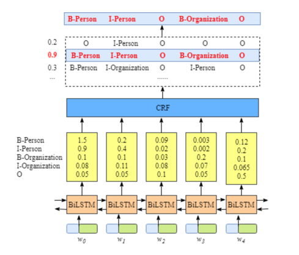

### 模型架构

1. 字词嵌入 作为输入
2. BiLSTM输出标签预测
3. 输入CRF进一步学习各标签转移概率，整句的最佳概率，选择预测得分最高的标签序列作为最佳答案

## CRF 的作用

CRF层可以向最终的预测标签添加一些约束，以确保它们是有效的。这些约束可以由CRF层在训练过程中从训练数据集自动学习。

约束条件可以是：
- 句子中第一个单词的标签应该以“B-”或“O”开头，而不是“I-”
- “B-label1 I-label2 I-label3 I-…”，在这个模式中，label1、label2、label3…应该是相同的命名实体标签。例如，“B-Person I-Person”是有效的，但是“B-Person I-Organization”是无效的。
- “O I-label”无效。一个命名实体的第一个标签应该以“B-”而不是“I-”开头，换句话说，有效的模式应该是“O B-label”

## CRF-Emission得分
这些emission分数来自BiLSTM层，是这个句子第 $i$ 种情况下的标签排序组合

该公式的第 $j$ 位对应第 $j$ 个单词的按照该tag的标记分数，所以理论上全部有 $tagSize^{sentenceLength}$ 个组合（包含了不合理的句式）

$$ EmissionScore_ {i} = x_ {0, start} + x_ {1, B-person} + x_ {2, I-person} + x_ {3, O} + ...$$

## CRF-Transition得分
各个标签之间的所有得分（理解为转移概率？），该矩阵( $T * T$, $T: tag_size$ )是BiLSTM-CRF模型的参数

而实际上构成这个公式的得分，比如 $t_ {start, B-person}$ 也是模型学习的参数

特别地，比如我们限制 `不能从结尾标签再有后续的标签`， 那么 $t_ {end, anyTag}$ 均为 -10000.0 （因为exp(x)令其变成无限接近0）

$$ TransitionScore_ {i} = t_ {start, B-person} + t_ {B-person, I-person} + t_ {I-person, O} + ...$$

## CRF-实际路径得分

所有路径的得分为

$$ P_ {total} = P1 + P2 + ... + Pn = e^{S1} + e^{S2} + ... + e^{Sn} $$

其中, $i$ 代表第 $i$ 种可能的路径，并且其分数为 $S_ {i} = EmissionScore_ {i} + TransitionScore_ {i}$

理论上，得到全部可能的路径得分，最真实路径的占比应该最高。

### 参考
- 代码应用
  - [官方](https://pytorch.org/tutorials/beginner/nlp/advanced_tutorial.html)
  - [git1-pytorch](https://github.com/jidasheng/bi-lstm-crf)
  - [git2-pytorch](https://github.com/threelittlemonkeys/lstm-crf-pytorch)

- [通俗易懂！BiLSTM上的CRF，用命名实体识别任务来解释CRF（一）](https://zhuanlan.zhihu.com/p/119254570)
