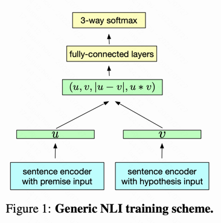
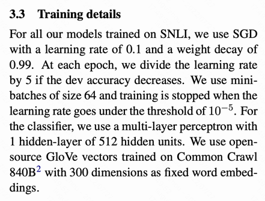

# 句子间的相关性

# 基础介绍
*任务描述*

句间关系的输入是一对文本，输出是文本间的关系。常用的判别有语义相似度、语义关系推理（蕴含/中立/矛盾）、问答对等，拿GLUE榜单来说，其中有6个（QQP/MNLI/QNLI/STS/RTE/MRPC）都是句间关系任务。

*业务应用*

比如搜索推荐的语义相关性、智能问答中的问题-问题、问题-答案匹配、知识图谱中的实体链接、关系识别等，

*DL模型类型*

在深度学习中，文本匹配模型可以分为两种结构：双塔式和交互式。 双塔式模型也称孪生网络、Representation-based，就是用一个编码器分别给两个文本编码出句向量，然后把两个向量融合过一个浅层的分类器；交互是也称Interaction-based，就是把两个文本一起输入进编码器，在编码的过程中让它们相互交换信息，再得到最终结果。

两种框架比较的话，交互式通常准确率会高一些，毕竟编码器能使用的信息更多了，而双塔式的速度会快很多，比如线上来一个query，库里有一百万个候选，等交互式算完了用户都走了，但双塔式的候选可以提前计算好，只用给query编码后去和候选向量进行浅层计算就好了。工程落地的话，通常会用双塔式来做召回，把一百万个候选缩减为10个，再对这10个做更精细的计算。

## 模型：双塔式（相对好落地，因此多了解些）

### InferSent

#### 基本信息

项目github：https://github.com/facebookresearch/InferSent
- 基于 Glove 或 fastText 作为最初的 word-vectors
- 提供 sentence encoder 
  - 已经 pre-trained 
  - 对句子encode 
  - 句子内的单词重要性可视化
  
论文：https://aclanthology.org/D17-1070.pdf

#### 摘要主要思想

文中指出无监督学习句子的 emb 效果差强人意（可能指的是类似bert的句子上下文的训练？）。
本文用  Stanford Natural Language Inference datasets (SNLI) 的监督类数据训练全局的句子表示，
在多个迁移任务里，表现强于 SkipThought 的无监督向量训练。
文中利用 ImageNet 提取特征。

#### 正文信息
 NLI 任务 (3.1 The Natural Language Inference task)
文中用 SNLI 数据集，执行三分类任务：句子对之间的 类似、相反、中性。
目标是学习句子表示。

*模型训练方法* 有两种，本文选择第一种（双塔）：
（1）句子分开表示 （2）句子联合表示（能够学习到交叉的特征）

> Models can be trained on SNLI in two different ways: (i) sentence encoding-based models that explicitly separate the encoding of the individual sentences and (ii) joint methods that allow to use encoding of both sentences (to use cross-features or attention from one sentence to the other).

*句子 encoder 架构设计*  (3.2 Sentence encoder architecture)：
对比了7种架构，基本上是单向/双向的 LSTM 和 GRU，结合 max/mean pooling

> 训练细节
>
> 

## 模型：交互式

# 我的实现

## 尝试1. 
- 做法
    - bert-base作为encoder，获取句子的emb。这里是固定的，bert先不做fine-tune。这里采用的是 [CLS] 的emb，实际上是效果比较差的
      （见 [bert选取哪个emb作为句子向量表示比较好？](https://blog.csdn.net/u012526436/article/details/115736907) ）
    - 两个输入分别输入，分别通过多层的fully-connected layers（这里是否合理？句子互换位置是否还能获取相同的输出？）以此来获取高维度特征
    - 最后用 cosine 或者 softmax 来获取相似概率
- 结果：在200个epoch后，测试集准确率 从 63%提升至 72%，差强人意。

## 尝试2

## 尝试3

# 参考
- [单塔实现（交互类型）](https://colab.research.google.com/github/karm216/Fastpages-Notebooks/blob/master/_notebooks/2021-04-18-Quora%20Questions%20Pairs.ipynb#scrollTo=OPYy3UMICQN_)
  - 模型架构：1、合并两个句子 2、通过bert输出sequence_output 3、输入bi-lstm输出 4、进入平均池化、最大池化 5、两个池化结果concat 6、dropout和dense获取概率结果
  - 训练：先freeze bert模型部分，等待模型学习到上下文规律后；unfreeze bert部分，再用较低的学习率去迭代。
  - copy：https://colab.research.google.com/drive/1v6WpB9pu4lnEoOaZaE3R9MquIYVBppRY

- [知乎-综述-21个经典深度学习句间关系模型｜代码&技巧](https://zhuanlan.zhihu.com/p/357864974)
- [bert用于句子间的相似性判断](https://mccormickml.com/2019/05/14/BERT-word-embeddings-tutorial/#32-understanding-the-output)
    - 使用bert产出的second-to-last的词emb平均作为句子emb
- [bert选取哪个emb作为句子向量表示比较好？](https://blog.csdn.net/u012526436/article/details/115736907)
    - bert的 pool cls 甚至比word2vec表现还差
    - 一般可以使用最后一层 + 第一层 的emb平均作为句子emb
    - `上式要成立需要保证我们的向量的基底是标准正交基，基底如果不同，那么內积的计算公式就不一样，cosine similarity的计算自然也就不一样了，bert生成的embedding的坐标系是否是标准正交基我们不得而知了，但是既然效果不理想我们完全可以猜测大概率不是。`

- https://github.com/google-research/bert/issues/276
    - bert产出的句子emb不适宜直接用作cosine判断相似度
    `You can't use cosine distance directly between the embeddings produced by BERT. You need to apply another layer between the distance and BERT.
So on top of BERT, you put your custom layer (I used LSTM, but a simple Feed Forward network might be enough depending on what you're trying to achieve), and use the output of this custom layer to compute the cosine distance.`
- [如何使用 BERT 和 Word2Vec 计算句子相似性](https://geek.digiasset.org/pages/nlp/nlpinfo/using-similarity-sentence-bert-word2vec-_21Apr13202631442339/)
- [Sentence-BERT 语义相似度双塔模型](https://blog.csdn.net/weixin_42327752/article/details/124147253)
