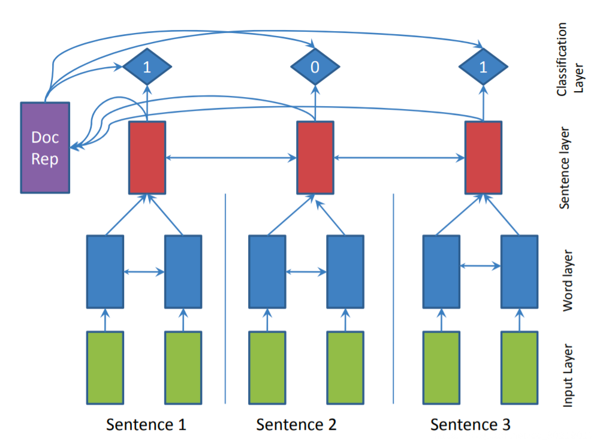

# 1 抽取式摘要
## 1.1 传统方法

### Lead-3

作者常常会在标题和文章开始就表明主题，因此最简单的方法就是抽取文章中的前几句作为摘要。常用的方法为 Lead-3，即抽取文章的前三句作为文章的摘要。Lead-3 方法虽然简单直接，但却是非常有效的方法。

### TextRank

- 任务：用于关键词提取，文本摘要等问题
- 简述：TextRank 算法仿照 PageRank，将句子作为节点，使用句子间相似度，构造无向有权边。使用边上的权值迭代更新节点值，最后选取 N 个得分最高的节点，作为摘要。
- 参考：
  - https://blog.csdn.net/sjyttkl/article/details/85092785
  - https://blog.csdn.net/u013250861/article/details/119972657
    
PageRank：
>PageRank考虑到不同网页之间，一般会通过超链接相连，即用户可以通过A网页中的链接，跳转到B网页，这种互相跳转关系，可以理解为一种“投票”行为，A网页连接到B网页，表示A网页对B网页的认可，即A网页给B网页投了一票。给B网页投票（链接）的越多，B网页的价值也就越大

## 1.2 序列标注方式

抽取式摘要可以建模为序列标注任务进行处理，其核心想法是：为原文中的每一个句子打一个二分类标签（0 或 1），0 代表该句不属于摘要，1 代表该句属于摘要。最终摘要由所有标签为 1 的句子构成。

### 基本框架

构造一个双向GRU模型，建模词语级别和句子级别的表示。

[SummaRuNNer 论文精读参考](https://blog.csdn.net/qq_30219017/article/details/86712757)
 
> SummaRuNNer 模型示意图
> 
> 蓝色部分为词语级别表示，红色部分为句子级别表示，对于每一个句子表示，有一个 0、1 标签输出，指示其是否是摘要。
> 
> 

该模型的训练需要监督数据，现有数据集往往没有对应的句子级别的标签，因此需要通过启发式规则进行获取。
> 首先选取原文中与标准摘要计算 ROUGE 得分最高的一句话加入候选集合，接着继续从原文中进行选择，保证选出的摘要集合 ROUGE 得分增加，直至无法满足该条件。得到的候选摘要集合对应的句子设为 1 标签，其余为 0 标签。
> 
> Rouge 得分: https://www.jianshu.com/p/0afb93fda403
