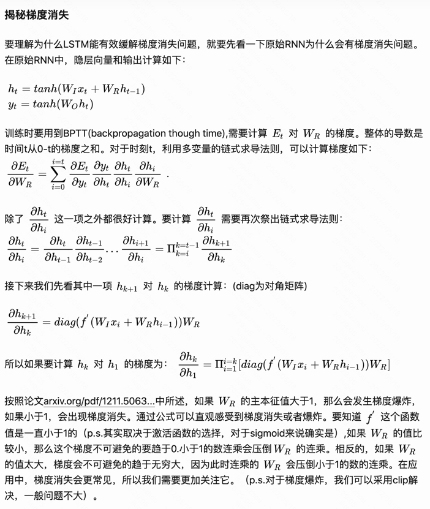
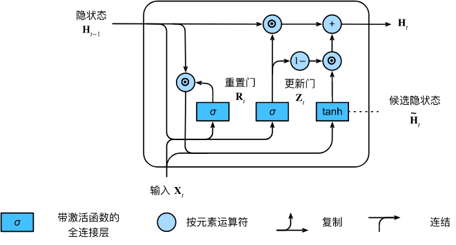
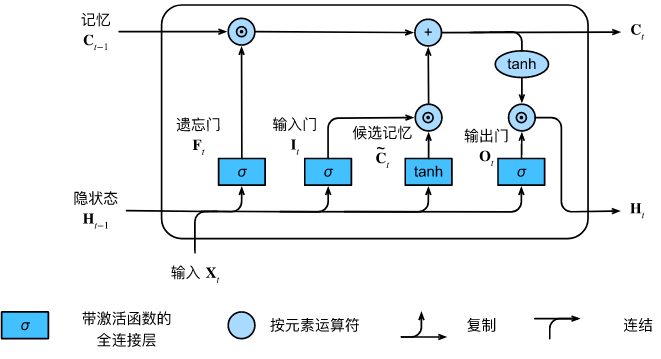
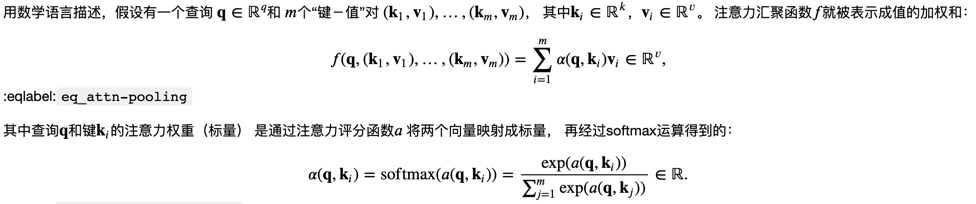

# 深度学习 - NLP部分

- 核心参考
  - hugging-face 
    - [官网](https://huggingface.co/)
    - [notebooks](https://huggingface.co/docs/transformers/v4.20.0/en/notebooks)
    - [course](https://huggingface.co/course/chapter2/2?fw=pt)
    - [transformer](https://huggingface.co/docs/transformers/model_doc/albert#transformers.AlbertForTokenClassification)
  - 中文预训练
    - [bert-wwm](https://github.com/ymcui/Chinese-BERT-wwm)
  - pytorch 
    - [torchtext，含有数据集](https://github.com/pytorch/text)
  - [bert可视化](https://huggingface.co/exbert/?model=bert-large-uncased&modelKind=bidirectional&sentence=Do%20not%20meddle%20in%20the%20affairs%20of%20wizards,%20for%20they%20are%20subtle%20and%20quick%20to%20anger.&layer=0&heads=..0,1,2,3,4,5,6,7,8,9,10,11,12,13,14,15&threshold=0.36&tokenInd=null&tokenSide=null&maskInds=..&hideClsSep=true)


## 发展历史整体感知
从`综述`、博客不断积累，自己整理出整体发展的历史，再逐个掌握


```markdown 
-- https://markmap.js.org/repl
# NLP
## 经典模型

### 统计机器学习
#### ......

### 神经网络
#### 词向量
##### NNLM
##### Word2Vec
##### FaseText
##### Glove
#### CNN
#### RNN & LSTM & GRU
#### Bert 
#### ElMo?
```

综述1:
[2020 A Survey on Text Classification: From Shallow to Deep Learning](https://arxiv.org/pdf/2008.00364v2.pdf)


## TextCNN

重要参考

| type 	| paper                                                                                                             	| intro                                                                         	| link                                  	|
|------	|-------------------------------------------------	|-------------------------------------------------	|----------------	|
| 原作 	| 2014-Convolutional Neural Networks for Sentence Classification                                                         	| (1) CNN-random-init <br> (2)CNN-static <br> (3)CNN-non-static <br> (4)CNN-multichannel 	| [link](https://aclanthology.org/D14-1181.pdf) 	|
| 衍生解读1 	| 2016-A Sensitivity Analysis of (and Practitioners’ Guide to) Convolutional Neural Networks for Sentence Classification 	|                                                                                        	| [link](https://arxiv.org/pdf/1510.03820.pdf)  	|
| 我的记录 |[TextCNN-readme.md](/TextCNN/TextCNN-readme.md)||
| 我的代码复现 |jupyter文件|||


## RNN

**(1) 模型简述**

参考: [d2l-8.4. 循环神经网络](https://zh.d2l.ai/chapter_recurrent-neural-networks/rnn.html)

模型总体公式：

假设我们在时间步 $t$ 有小批量输入 

$\mathbf{X}_ {t} \in \mathbb{R}^{n \times d}$,
$\mathbf{H}_ {t} \in \mathbb{R}^{n \times h}$,
$\mathbf{W}_ {hh} \in \mathbb{R}^{h \times h}$,
$\mathbf{W}_ {xh} \in \mathbb{R}^{d \times h}$,
$\mathbf{b}_ {h} \in \mathbb{R}^{1 \times h}$,
$\mathbf{b}_ {q} \in \mathbb{R}^{1 \times q}$,

当前时间步隐藏变量由当前时间步的输入与前一个时间步的隐藏变量一起计算得出：

$$\mathbf{H}_ {t} = \phi ( \mathbf{X}_ {t} \mathbf{W}_ {xh} + \mathbf{H}_ {t-1} \mathbf{W}_ {hh}  + \mathbf{b}_ {h} )$$

对于时间步$t$，输出层的输出类似于多层感知机中的计算：

$$\mathbf{O}_ {t} = \mathbf{H}_ {t} \mathbf{W}_ {hq} + \mathbf{b}_ {q} $$


指标：困惑度(perplexity)：

我们可以通过一个序列中所有的 $n$ 个词元的交叉熵损失的平均值来衡量:

$$\frac{1}{n} \sum_{t=1}^n -\log P(x_t \mid x_ {t-1}, \ldots, x_1)$$

其中$P$由语言模型给出，
$x_t$是在时间步$t$从该序列中观察到的实际词元。
这使得不同长度的文档的性能具有了可比性。

$$\exp\left(-\frac{1}{n} \sum_ {t=1}^n \log P(x_ t \mid x_ {t-1}, \ldots, x_ 1)\right).$$

* 在最好的情况下，模型总是完美地估计标签词元的概率为1。
  在这种情况下，模型的困惑度为1。
* 在最坏的情况下，模型总是预测标签词元的概率为0。
  在这种情况下，困惑度是正无穷大。
* 在基线上，该模型的预测是词表的所有可用词元上的均匀分布。
  在这种情况下，困惑度等于词表中唯一词元的数量。

小结

* 循环神经网络的隐状态可以捕获直到当前时间步序列的历史信息。
* 循环神经网络模型的参数数量不会随着时间步的增加而增加。
* 我们可以使用循环神经网络创建字符级语言模型。
* 我们可以使用困惑度来评价语言模型的质量。


**(2) 训练**

参考
- [d2l-8.7. 通过时间反向传播](https://zh.d2l.ai/chapter_recurrent-neural-networks/bptt.html)
- [d2l-8.5. 循环神经网络的从零开始实现](https://zh.d2l.ai/chapter_recurrent-neural-networks/rnn-scratch.html)


公式有空再整理

- 循环神经网络模型在训练以前需要初始化状态，不过随机抽样和顺序划分使用初始化方法不同。[见<随机采样和顺序分区>](https://zh-v2.d2l.ai/chapter_recurrent-neural-networks/language-models-and-dataset.html)
- 当使用顺序划分时，我们需要分离梯度以减少计算量。
  > 具体来说，当使用顺序分区时， 我们只在每个迭代周期的开始位置初始化隐状态。 由于下一个小批量数据中的第 𝑖 个子序列样本 与当前第 𝑖 个子序列样本相邻， 因此当前小批量数据最后一个样本的隐状态， 将用于初始化下一个小批量数据第一个样本的隐状态。 这样，存储在隐状态中的序列的历史信息 可以在一个迭代周期内流经相邻的子序列。 然而，在任何一点隐状态的计算， 都依赖于同一迭代周期中前面所有的小批量数据， 这使得梯度计算变得复杂。 为了降低计算量，在处理任何一个小批量数据之前， 我们先分离梯度，使得隐状态的梯度计算总是限制在一个小批量数据的时间步内。
- 在进行任何预测之前，模型通过预热期进行自我更新（例如，获得比初始值更好的隐状态）。
- 梯度裁剪可以防止梯度爆炸，但不能应对梯度消失
- 矩阵 $\mathbf{W}_ {hh} \in \mathbb{R}^{h \times h}$ 的高次幂可能导致神经网络特征值的发散或消失，将以梯度爆炸或梯度消失的形式表现。
- 截断是计算方便性和数值稳定性的需要。截断包括：规则截断和
  随机截断(实现方法是有一定概率在某个时间步上截断，因此不用全部计算；但总体的期望是1，相当于理论公式；某些时间步会有更大的梯度权重)。
- 为了计算的效率，“通过时间反向传播”在计算期间会缓存中间值。


> 梯度爆炸的公式推导: https://zhuanlan.zhihu.com/p/109519044
> 


**(3)注意点**

QA：

- 为什么做字符而非预测单词？
  - 因为字符的vocab_size小，one-hot的向量也小。而单词则很大


---
- 参考
    - [深度学习之循环神经网络（RNN）](https://www.cnblogs.com/Luv-GEM/p/10703906.html)
    - [TensorFlow之RNN：堆叠RNN、LSTM、GRU及双向LSTM](https://www.cnblogs.com/Luv-GEM/p/10788849.html)
    - [循环神经网络之LSTM和GRU](https://www.cnblogs.com/Luv-GEM/p/10705967.html)
    - [rnn各类模型复现](https://github.com/spro/practical-pytorch)
    - [pytorch官方文章](https://pytorch.org/tutorials/intermediate/char_rnn_classification_tutorial.html#creating-the-network)
    - [rnn-含有很多现实案例](http://karpathy.github.io/2015/05/21/rnn-effectiveness/)


## 门控循环单元（gated recurrent units，GRU）

参考
- [9.1. 门控循环单元（GRU）](https://zh.d2l.ai/chapter_recurrent-modern/gru.html)

RNN需要解决的问题，可以由 GRU 和 LSTM来解决：
- 长期记忆 - 进行存储：早期观测值对预测所有未来观测值具有非常重要的意义。`我们希望有某些机制能够在一个记忆元里存储重要的早期信息`。 如果没有这样的机制，我们将不得不给这个观测值指定一个非常大的梯度， 因为它会影响所有后续的观测值。
- 选择遗忘 - 进行跳过：一些词元没有相关的观测值。 例如，在对网页内容进行情感分析时， 可能有一些辅助HTML代码与网页传达的情绪无关。 `我们希望有一些机制来跳过隐状态表示中的此类词元。`
- 逻辑中断 - 进行重置：序列的各个部分之间存在逻辑中断。 例如，书的章节之间可能会有过渡存在。我们希望重置我们的内部状态表示
- 其他需解决的：梯度消失和梯度爆炸




- Reset Gate：重置门。 与 $H_ {t-1}$ 进行点积，由于是 $(0,1)$ 的范围，因此能够选择遗忘 $H_ {t-1}$，从而减少以往状态的影响
- Update Gate：更新门。 当 $Z_ {t}$ 偏向 1 时，则选择更多的 $H_ {t-1}$，即记住更长期的信息；如果偏向于0，则选择更多的候选隐状态，即含有 $X_t$的当前信息

小结：
- 门控循环神经网络可以更好地捕获时间步距离很长的序列上的依赖关系。
- 重置门有助于捕获序列中的短期依赖关系。
- 更新门有助于捕获序列中的长期依赖关系。
- 重置门打开时，门控循环单元包含基本循环神经网络；更新门打开时，门控循环单元可以跳过子序列。


## 长短期记忆网络（long short-term memory，LSTM） 
参考
- [9.2. 长短期记忆网络（LSTM）](https://zh.d2l.ai/chapter_recurrent-modern/lstm.html)




小结
- 长短期记忆网络有三种类型的门：输入门、遗忘门和输出门。
- 长短期记忆网络的隐藏层输出包括“隐状态”和“记忆元”。只有隐状态会传递到输出层，而记忆元完全属于内部信息。
- 长短期记忆网络可以缓解梯度消失和梯度爆炸。

- 参考
  - [Understanding LSTM Networks](https://colah.github.io/posts/2015-08-Understanding-LSTMs/)
  - [为何能解决梯度消失问题？- Why LSTMs Stop Your Gradients From Vanishing](https://weberna.github.io/blog/2017/11/15/LSTM-Vanishing-Gradients.html)
  - [为何能解决梯度消失问题？- 中文翻译](https://zhuanlan.zhihu.com/p/109519044)
  

## RNN簇的比较点

- RNN最长序列一般为几十，难以做到上百的长度（所以随机抽样即可，还可以避开overfit问题，不一定要因为序列的关联性而用顺序分区）
- GRU的更新门 $Z_ {t}$ 是加权求和（1-z与z），而LSTM的记忆单元 $C_ {t}$ 是加和得到的，而 $H_ {t}$ 是由输出门 $O_ {t}$决定是否重置


## fastText 

- 官方参考
  - 官方：https://fasttext.cc/
  - git：https://github.com/facebookresearch/fastText
  - 官方-文本分类：https://fasttext.cc/docs/en/supervised-tutorial.html
  - FAQ：https://fasttext.cc/docs/en/faqs.html
    - reduce the size of my fastText models
- 论文
  - 原作(2016)：https://arxiv.org/pdf/1607.01759.pdf 
    - 实验数据：1  Sentiment analysis 2 tag predictions（有多个tag的情况）
  
> A simple and efficient baseline for sentence classification is to represent sentences as bag of words (BoW) and train a linear classifier, e.g., a logistic regression or an SVM (Joachims, 1998; Fan et al., 2008). However, linear classifiers do not share parameters among features and classes. This possibly limits their generalization in the context of large output space where some classes have very few examples. Common solutions to this problem are to factorize the linear classifier into low rank matrices (Schutze, 1992; Mikolov et al., 2013) or to use multilayer neural networks (Collobert and Weston, 2008; Zhang et al., 2015).
>
> 句子分类的一个简单有效的基线是将句子表示为词袋 (BoW) 并训练线性分类器，例如逻辑回归或 SVM (Joachims, 1998; Fan et al., 2008)。 然而，线性分类器不共享特征和类之间的参数。 这可能会限制它们在大输出空间的上下文中的泛化，其中某些类的示例很少。 这个问题的常见解决方案是将线性分类器分解为低秩矩阵（Schutze，1992；Mikolov 等人，2013）或使用多层神经网络（Collobert 和 Weston，2008；Zhang 等人，2015）。


## Bert

- Bert论文：https://arxiv.org/abs/1810.04805


## ElMo


## Word Embedding 词嵌入
`word2vec, fastText, Glove, Bert`

概念上而言，它是指把一个维数为所有词的数量的高维空间嵌入到一个维数低得多的连续向量空间中，每个单词或词组被映射为实数域上的向量。
[wiki](https://zh.wikipedia.org/wiki/%E8%AF%8D%E5%B5%8C%E5%85%A5)

特点
- 高维度转低维度表示：单词个数 |V| (one-hot) 转化为指定维度
- 词汇之间能够表示相似度
- 向量的每一维没有含义

文本表示有哪些方法？
- 基于one-hot、tf-idf、textrank等的bag-of-words 
  - 维度灾难
  - 语义鸿沟
- 主题模型：LSA（SVD）、pLSA、LDA
  - 计算量复杂
- 基于词向量的固定表征：word2vec、fastText、glove
  - 相同上下文语境的词有似含义
  - 固定表征无法表示"一词多义"（因为一个单词只有一个emb？）
- 基于词向量的动态表征：elmo、GPT、bert

单个介绍
- word2vec(2013)
  - 论文：
    - 原作者-[word2vec思想](https://arxiv.org/pdf/1301.3781.pdf) (也讨论了和NNLM等的区别)
    - 原作者-Skip-gram模型的两个策略：[Hierarchical Softmax 和 Negative Sampling](https://papers.nips.cc/paper/2013/file/9aa42b31882ec039965f3c4923ce901b-Paper.pdf)
    - 原作者的[博士论文（2012），适合用于了解历史](https://www.fit.vut.cz/study/phd-thesis-file/283/283.pdf)
    - 其他作者解读
      - [word2vec Parameter Learning Explained](https://arxiv.org/pdf/1411.2738.pdf)
      - [word2vec Explained: Deriving Mikolov et al.’s Negative-Sampling Word-Embedding Method](https://arxiv.org/pdf/1402.3722.pdf)
  - 要点
    - Huffman Tree 霍夫曼二叉树：权值更高的离树越近
  - 博客参考：
    - [word2vec原理(一) CBOW与Skip-Gram模型基础](https://www.cnblogs.com/pinard/p/7160330.html)
    - [word2vec原理(二) 基于Hierarchical Softmax的模型](https://www.cnblogs.com/pinard/p/7243513.html)
    
  - 其实word2vec和Co-Occurrence Vector的思想是很相似的，都是基于一个统计学上的假设：经常在同一个上下文出现的单词是相似的。只是他们的实现方式是不一样的，前者是采用词频统计，降维，矩阵分解等确定性技术；而后者则采用了神经网络进行不确定预测，它的提出主要是采用神经网络之后计算复杂度和最终效果都比之前的模型要好。所以那篇文章的标题才叫：Efficient Estimation of Word Representations in Vector Space。[参考](http://www.fanyeong.com/2017/10/10/word2vec/) 


- Glove [原论文](https://nlp.stanford.edu/pubs/glove.pdf)

# Transfomer系列

[历史介绍](https://huggingface.co/course/en/chapter1/4?fw=pt#a-bit-of-transformer-history)


## 基础知识

注意力 

[参考：10.1. 注意力提示](https://zh-v2.d2l.ai/chapter_attention-mechanisms/attention-cues.html)

参数化全连接层、非参数化的pooling，都是提取该区域最大或者平均的特征，相当于被迫纳入了提示（在草丛中看到红色花朵）。
>首先，考虑一个相对简单的状况， 即只使用非自主性提示。 要想将选择偏向于感官输入， 我们可以简单地使用参数化的全连接层， 甚至是非参数化的最大汇聚层或平均汇聚层。“是否包含自主性提示”将注意力机制与全连接层或汇聚层区别开来。 在注意力机制的背景下，我们将自主性提示称为查询（query）。 给定任何查询，注意力机制通过注意力汇聚（attention pooling） 将选择引导至感官输入（sensory inputs，例如中间特征表示）。 在注意力机制中，这些感官输入被称为值（value）。 更通俗的解释，每个值都与一个键（key）配对， 这可以想象为感官输入的非自主提示。 如 图10.1.3所示，我们可以设计注意力汇聚， 以便给定的查询（自主性提示）可以与键（非自主性提示）进行匹配， 这将引导得出最匹配的值（感官输入）。

注意力评分函数

[参考：10.3. 注意力评分函数](https://zh-v2.d2l.ai/chapter_attention-mechanisms/attention-scoring-functions.html)

- 掩蔽softmax操作
- 加性注意力
- 缩放点积注意力

小结：
- 将注意力汇聚的输出计算可以作为值的加权平均，选择不同的注意力评分函数会带来不同的注意力汇聚操作。
- 当查询和键是不同长度的矢量时，可以使用可加性注意力评分函数。当它们的长度相同时，使用缩放的“点－积”注意力评分函数的计算效率更高。

在这个教程里，体现了查询q，在注意力里面和 键-值的计算关系。特别地，在代码里，扩展到了高维度的计算方法。（不太好懂，需要反复看代码 print(shape) ）



课后qa：
- masked_softmax的作用：比如，在句子不够长时（4 out of 10），padding填充了6个。那么拿到query时，要看键值，此时仅需要看前4个，后6个没有意义。

参考：
- [知乎-transformer解析和实现](https://zhuanlan.zhihu.com/p/420820453)


