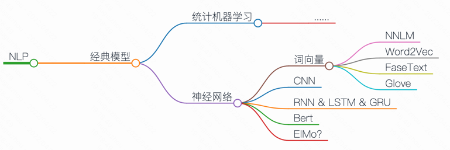
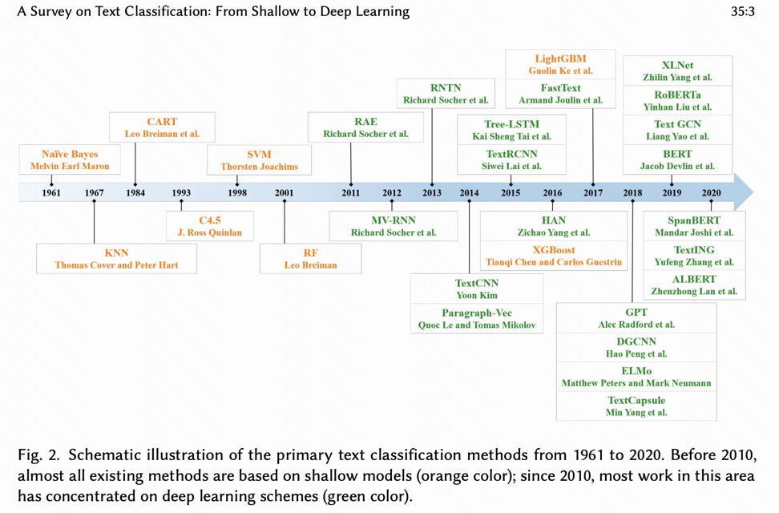

# 深度学习 - NLP部分

## 发展历史整体感知
从`综述`、博客不断积累，自己整理出整体发展的历史，再逐个掌握



```markdown 
-- https://markmap.js.org/repl
# NLP
## 经典模型

### 统计机器学习
#### ......

### 神经网络
#### 词向量
##### NNLM
##### Word2Vec
##### FaseText
##### Glove
#### CNN
#### RNN & LSTM & GRU
#### Bert 
#### ElMo?
```

综述1:
[2020 A Survey on Text Classification: From Shallow to Deep Learning](https://arxiv.org/pdf/2008.00364v2.pdf)



## TextCNN

重要参考

| type 	| paper                                                                                                             	| intro                                                                         	| link                                  	|
|------	|-------------------------------------------------	|-------------------------------------------------	|----------------	|
| 原作 	| 2014-Convolutional Neural Networks for Sentence Classification                                                         	| (1) CNN-random-init <br> (2)CNN-static <br> (3)CNN-non-static <br> (4)CNN-multichannel 	| [link](https://aclanthology.org/D14-1181.pdf) 	|
| 衍生解读1 	| 2016-A Sensitivity Analysis of (and Practitioners’ Guide to) Convolutional Neural Networks for Sentence Classification 	|                                                                                        	| [link](https://arxiv.org/pdf/1510.03820.pdf)  	|
| 我的记录 |[TextCNN-readme.md](/TextCNN/TextCNN-readme.md)||
| 我的代码复现 |jupyter文件|||


## RNN

**模型简述**

参考: [d2l-8.4. 循环神经网络](https://zh.d2l.ai/chapter_recurrent-neural-networks/rnn.html)

假设我们在时间步 $t$ 有小批量输入 $\mathbf{X}_t \in \mathbb{R}^{n \times d}$

$\mathbf{H}_t \in \mathbb{R}^{n \times h}$

$\mathbf{W}_{hh} \in \mathbb{R}^{h \times h}$

当前时间步隐藏变量由当前时间步的输入与前一个时间步的隐藏变量一起计算得出：

$\mathbf{H}_t = \phi $ 

$( \mathbf{X}_{t} \mathbf{W}_{xh} + \mathbf{H}_{t-1} \mathbf{W}_{hh}  + \mathbf{b}_{h} )$

对于时间步$t$，输出层的输出类似于多层感知机中的计算：

$\mathbf{O}_t = \mathbf{H}_{t} \mathbf{W}_{hq} + \mathbf{b}_{q}$

**训练**

参考: [d2l-8.7. 通过时间反向传播](https://zh.d2l.ai/chapter_recurrent-neural-networks/bptt.html)


- 参考
    - [深度学习之循环神经网络（RNN）](https://www.cnblogs.com/Luv-GEM/p/10703906.html)
    - [TensorFlow之RNN：堆叠RNN、LSTM、GRU及双向LSTM](https://www.cnblogs.com/Luv-GEM/p/10788849.html)
    - [循环神经网络之LSTM和GRU](https://www.cnblogs.com/Luv-GEM/p/10705967.html)
    - [rnn各类模型复现](https://github.com/spro/practical-pytorch)
    - [pytorch官方文章](https://pytorch.org/tutorials/intermediate/char_rnn_classification_tutorial.html#creating-the-network)
    - [rnn-含有很多现实案例](http://karpathy.github.io/2015/05/21/rnn-effectiveness/)


## GRU

## LSTM 

- 参考
    - [Understanding LSTM Networks](https://colah.github.io/posts/2015-08-Understanding-LSTMs/)

## Bert

## ElMo


## Word Embedding 词嵌入
`word2vec, fastText, Glove, Bert`

概念上而言，它是指把一个维数为所有词的数量的高维空间嵌入到一个维数低得多的连续向量空间中，每个单词或词组被映射为实数域上的向量。
[wiki](https://zh.wikipedia.org/wiki/%E8%AF%8D%E5%B5%8C%E5%85%A5)

特点
- 高维度转低维度表示：单词个数 |V| (one-hot) 转化为指定维度
- 词汇之间能够表示相似度
- 向量的每一维没有含义

文本表示有哪些方法？
- 基于one-hot、tf-idf、textrank等的bag-of-words 
  - 维度灾难
  - 语义鸿沟
- 主题模型：LSA（SVD）、pLSA、LDA
  - 计算量复杂
- 基于词向量的固定表征：word2vec、fastText、glove
  - 相同上下文语境的词有似含义
  - 固定表征无法表示"一词多义"（因为一个单词只有一个emb？）
- 基于词向量的动态表征：elmo、GPT、bert

单个介绍
- word2vec(2013)
  - 论文：
    - 原作者-[word2vec思想](https://arxiv.org/pdf/1301.3781.pdf) (也讨论了和NNLM等的区别)
    - 原作者-Skip-gram模型的两个策略：[Hierarchical Softmax 和 Negative Sampling](https://papers.nips.cc/paper/2013/file/9aa42b31882ec039965f3c4923ce901b-Paper.pdf)
    - 原作者的[博士论文（2012），适合用于了解历史](https://www.fit.vut.cz/study/phd-thesis-file/283/283.pdf)
    - 其他作者解读
      - [word2vec Parameter Learning Explained](https://arxiv.org/pdf/1411.2738.pdf)
      - [word2vec Explained: Deriving Mikolov et al.’s Negative-Sampling Word-Embedding Method](https://arxiv.org/pdf/1402.3722.pdf)
  - 要点
    - Huffman Tree 霍夫曼二叉树：权值更高的离树越近
  - 博客参考：
    - [word2vec原理(一) CBOW与Skip-Gram模型基础](https://www.cnblogs.com/pinard/p/7160330.html)
    - [word2vec原理(二) 基于Hierarchical Softmax的模型](https://www.cnblogs.com/pinard/p/7243513.html)
    
  - 其实word2vec和Co-Occurrence Vector的思想是很相似的，都是基于一个统计学上的假设：经常在同一个上下文出现的单词是相似的。只是他们的实现方式是不一样的，前者是采用词频统计，降维，矩阵分解等确定性技术；而后者则采用了神经网络进行不确定预测，它的提出主要是采用神经网络之后计算复杂度和最终效果都比之前的模型要好。所以那篇文章的标题才叫：Efficient Estimation of Word Representations in Vector Space。[参考](http://www.fanyeong.com/2017/10/10/word2vec/) 

