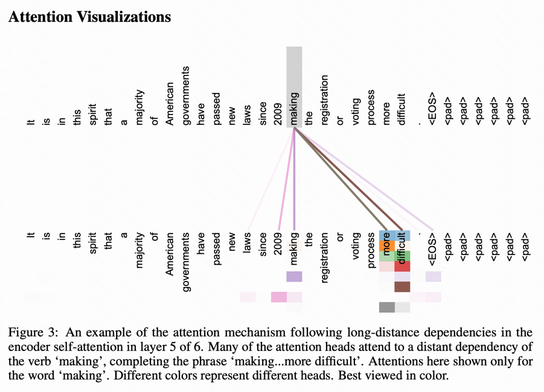

Attention Is All You Need

[PDF](https://arxiv.org/pdf/1706.03762.pdf)

摘要

`基于注意力，摒弃递归和卷积`: 主要的序列转导模型基于复杂的循环或卷积神经网络，包括编码器和解码器。性能最好的模型还通过注意力机制连接编码器和解码器。我们提出了一种新的简单网络架构 Transformer，它完全基于注意力机制，完全摒弃了递归和卷积。

`任务上表现`: 对两个机器翻译任务的实验表明，这些模型在质量上更优越，同时更可并行化，并且需要的训练时间显着减少。我们的模型在 WMT 2014 英德翻译任务上达到了 28.4 BLEU，比现有的最佳结果（包括合奏）提高了 2 BLEU 以上。在 WMT 2014 英法翻译任务上，我们的模型在 8 个 GPU 上训练 3.5 天后，建立了一个新的单模型 state-of-the-art BLEU 得分 41.8，这只是最好的训练成本的一小部分。文献中的模型。我们表明，Transformer 通过成功地将其应用于具有大量和有限训练数据的英语选区解析，可以很好地推广到其他任务。

> The dominant sequence transduction models are based on complex recurrent or convolutional neural networks that include an encoder and a decoder. The best performing models also connect the encoder and decoder through an attention mechanism. We propose a new simple network architecture, the Transformer, based solely on attention mechanisms, dispensing with recurrence and convolutions entirely. Experiments on two machine translation tasks show these models to be superior in quality while being more parallelizable and requiring significantly less time to train. Our model achieves 28.4 BLEU on the WMT 2014 Englishto-German translation task, improving over the existing best results, including ensembles, by over 2 BLEU. On the WMT 2014 English-to-French translation task, our model establishes a new single-model state-of-the-art BLEU score of 41.8 after training for 3.5 days on eight GPUs, a small fraction of the training costs of the best models from the literature. We show that the Transformer generalizes well to other tasks by applying it successfully to English constituency parsing both with large and limited training data.

1 Introduction

2 Background

3 Model Architecture

3.1 Encoder and Decoder Stacks

3.2 Attention

3.2.1 Scaled Dot-Product Attention

3.2.2 Multi-Head Attention

3.2.3 Applications of Attention in our Model

3.3 Position-wise Feed-Forward Networks

3.4 Embeddings and Softmax

3.5 Positional Encoding

4 Why Self-Attention

5 Training

6 Results

7 Conclusion

---

# 1 Introduction
要点
- 目前为止的研究：循环语言模型
- 算力约束：并行化能力差，sequential computation 的限制仍存在
- 注意力机制的应用：无需考虑在输入或输出序列中的距离；经常用于结合循环网络
- 论文的任务达成：提出Transformer模型，避免重复sequential架构，在翻译质量达到高水平

> 循环神经网络、长短期记忆 [13] 和门控循环 [7] 神经网络，尤其是已被牢固确立为序列建模和转导问题（如语言建模和机器翻译）的最先进方法 [35, 2 , 5]。 此后，许多努力继续推动循环语言模型和编码器-解码器架构的界限[38,24,15]。 
>
>循环模型通常沿输入和输出序列的符号位置考虑计算。 将位置与计算时间的步骤对齐，它们生成一系列隐藏状态 ht，作为先前隐藏状态 ht-1 和位置 t 的输入的函数。 `这种固有的顺序性质排除了训练示例中的并行化，这在更长的序列长度下变得至关重要，因为内存限制限制了示例之间的批处理`。 最近的工作通过分解技巧 [21] 和条件计算 [32] 显着提高了计算效率，同时在后者的情况下也提高了模型性能。 然而，顺序计算的基本约束仍然存在
> 
>注意机制已成为各种任务中引人注目的序列建模和转导模型的组成部分，允许对依赖项进行建模，而无需考虑它们在输入或输出序列中的距离 [2, 19]。 然而，除了少数情况[27]，这种注意力机制与循环网络结合使用。
> 
>在这项工作中，我们提出了 Transformer，这是一种避免重复的模型架构，而是完全依赖注意力机制来绘制输入和输出之间的全局依赖关系。 在八个 P100 GPU 上经过短短 12 小时的训练后，Transformer 可以实现更多的并行化，并且可以在翻译质量方面达到新的水平。

> Recurrent neural networks, long short-term memory [13] and gated recurrent [7] neural networks in particular, have been firmly established as state of the art approaches in sequence modeling and transduction problems such as language modeling and machine translation [35, 2, 5]. Numerous efforts have since continued to push the boundaries of recurrent language models and encoder-decoder architectures [38, 24, 15].
> 
> Recurrent models typically factor computation along the symbol positions of the input and output sequences. Aligning the positions to steps in computation time, they generate a sequence of hidden states ht, as a function of the previous hidden state ht−1 and the input for position t. This inherently sequential nature precludes parallelization within training examples, which becomes critical at longer sequence lengths, as memory constraints limit batching across examples. Recent work has achieved significant improvements in computational efficiency through factorization tricks [21] and conditional computation [32], while also improving model performance in case of the latter. The fundamental constraint of `sequential computation`, however, remains
> 
> Attention mechanisms have become an integral part of compelling sequence modeling and transduction models in various tasks, allowing modeling of dependencies without regard to their distance in the input or output sequences [2, 19]. In all but a few cases [27], however, such attention mechanisms are used in conjunction with a recurrent network.
> 
> In this work we propose the Transformer, a model architecture eschewing recurrence and instead relying entirely on an attention mechanism to draw global dependencies between input and output. The Transformer allows for significantly more parallelization and can reach a new state of the art in translation quality after being trained for as little as twelve hours on eight P100 GPUs.

# 2 Background

要点：
- 减少sequential computation 是各大模型的基础，以卷积神经网络作为基本构建块
- 提取两个任意输入/输出位置的信号所需的操作量会随着距离增长而增长：ConvS2S-线性增长，ByteNet-对数增长。而Transformer做到常数
- 由于平均注意力加权位置而降低了有效分辨率，我们使用多头注意力来抵消这种影响

> 减少顺序计算的目标也构成了扩展神经 GPU [16]、ByteNet [18] 和 ConvS2S [9] 的基础，所有这些都使用卷积神经网络作为基本构建块，并行计算所有输入的隐藏表示和 输出位置。 在这些模型中，关联来自两个任意输入或输出位置的信号所需的操作数量随着位置之间的距离而增长，对于 ConvS2S 呈线性增长，而对于 ByteNet 则呈对数增长。 这使得学习远距离位置之间的依赖关系变得更加困难[12]。 在 Transformer 中，这被减少到`恒定数量`的操作，尽管由于平均注意力加权位置而降低了有效分辨率，我们使用多头注意力来抵消这种影响，如第 3.2 节所述。
> 
> 自注意，有时称为内部注意，是一种将单个序列的不同位置关联起来以计算序列表示的注意机制。 自注意力已成功用于各种任务，包括阅读理解、抽象摘要、文本蕴涵和学习任务无关的句子表示 [4, 27, 28, 22]。
> 
> 端到端记忆网络基于循环注意机制而不是序列对齐循环，并且已被证明在简单语言问答和语言建模任务中表现良好[34]。
> 
> 然而，据我们所知，Transformer 是第一个完全依赖自注意力来计算其输入和输出表示而不使用序列对齐 RNN 或卷积的转换模型。 在接下来的部分中，我们将描述 Transformer，激发自注意力并讨论其相对于 [17、18] 和 [9] 等模型的优势。

> The goal of reducing sequential computation also forms the foundation of the Extended Neural GPU [16], ByteNet [18] and ConvS2S [9], all of which use convolutional neural networks as basic building block, computing hidden representations in parallel for all input and output positions. In these models, the number of operations required to relate signals from two arbitrary input or output positions grows in the distance between positions, linearly for ConvS2S and logarithmically for ByteNet. This makes it more difficult to learn dependencies between distant positions [12]. In the Transformer this is reduced to a `constant number of operations`, albeit at the cost of reduced effective resolution due to averaging attention-weighted positions, an effect we counteract with Multi-Head Attention as described in section 3.2.
> 
> Self-attention, sometimes called intra-attention is an attention mechanism relating different positions of a single sequence in order to compute a representation of the sequence. Self-attention has been used successfully in a variety of tasks including reading comprehension, abstractive summarization, textual entailment and learning task-independent sentence representations [4, 27, 28, 22].
> 
> End-to-end memory networks are based on a recurrent attention mechanism instead of sequence aligned recurrence and have been shown to perform well on simple-language question answering and language modeling tasks [34].
> 
> To the best of our knowledge, however, the Transformer is the first transduction model relying entirely on self-attention to compute representations of its input and output without using sequencealigned RNNs or convolution. In the following sections, we will describe the Transformer, motivate self-attention and discuss its advantages over models such as [17, 18] and [9].

# 3 Model Architecture

> 大多数竞争性神经序列转导模型具有编码器-解码器结构 [5, 2, 35]。 这里，编码器将符号表示的输入序列 (x1, ..., xn) 映射到连续表示的序列 z = (z1, ..., zn)。 给定 z，解码器然后一次生成一个元素的符号输出序列 (y1, ..., ym)。 在每个步骤中，模型都是自回归的 [10]，在生成下一个时将先前生成的符号用作附加输入。
> 
> Transformer 遵循这种整体架构，对编码器和解码器使用堆叠的自注意力和逐点全连接层，分别如图 1 的左半部分和右半部分所示。

> Most competitive neural sequence transduction models have an encoder-decoder structure [5, 2, 35]. Here, the encoder maps an input sequence of symbol representations (x1, ..., xn) to a sequence of continuous representations z = (z1, ..., zn). Given z, the decoder then generates an output sequence (y1, ..., ym) of symbols one element at a time. At each step the model is auto-regressive [10], consuming the previously generated symbols as additional input when generating the next.
> 
> The Transformer follows this overall architecture using stacked self-attention and point-wise, fully connected layers for both the encoder and decoder, shown in the left and right halves of Figure 1, respectively.

3.1 Encoder and Decoder Stacks

3.2 Attention

3.2.1 Scaled Dot-Product Attention

3.2.2 Multi-Head Attention

3.2.3 Applications of Attention in our Model

3.3 Position-wise Feed-Forward Networks

3.4 Embeddings and Softmax

3.5 Positional Encoding

4 Why Self-Attention

5 Training

6 Results

# 7 Conclusion

在这项工作中，我们提出了 Transformer，这是第一个完全基于注意力的序列转导模型，用多头自注意力取代了编码器-解码器架构中最常用的循环层。

对于翻译任务，Transformer 的训练速度明显快于基于循环或卷积层的架构。 在 WMT 2014 英语到德语和 WMT 2014 英语到法语的翻译任务上，我们都达到了新的水平。 在前一项任务中，我们最好的模型甚至优于所有先前报道的集成。

我们对基于注意力的模型的未来感到兴奋，并计划将它们应用于其他任务。 我们计划将 Transformer 扩展到涉及文本以外的输入和输出模式的问题，并研究局部的受限注意力机制，以有效处理图像、音频和视频等大型输入和输出。 减少生成的顺序是我们的另一个研究目标。

# Appendix

多头注意力机制，`making` 单词会注意多个词之后的 `more difficult`

