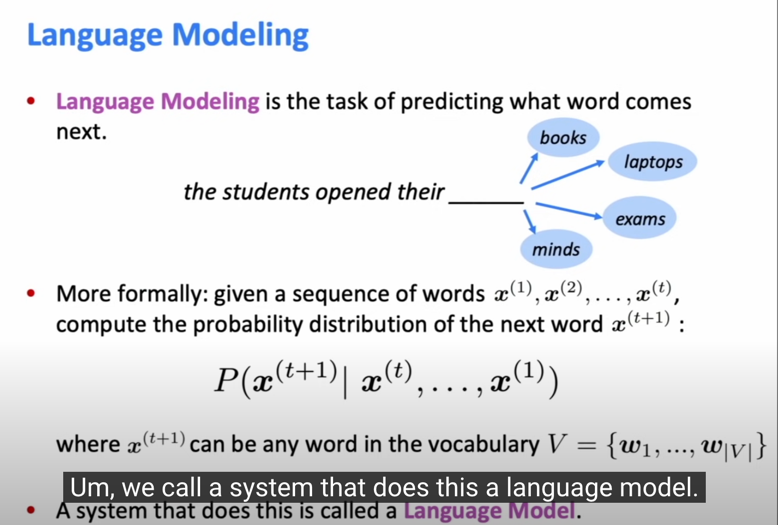
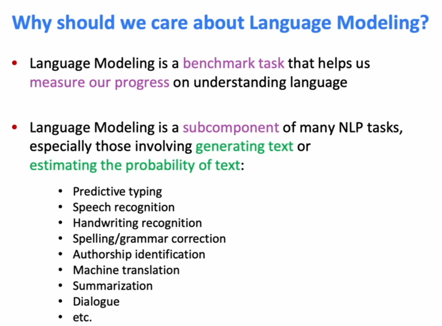
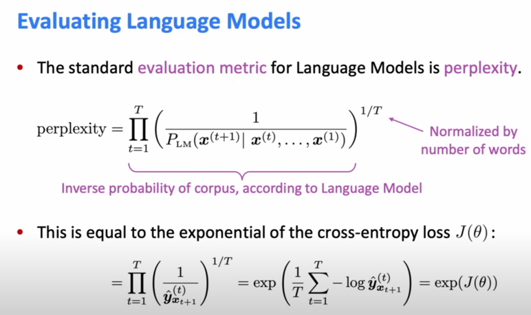
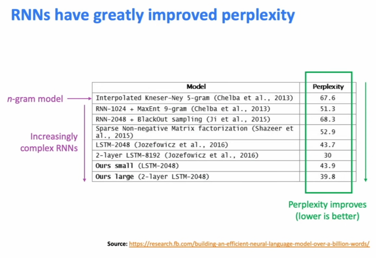
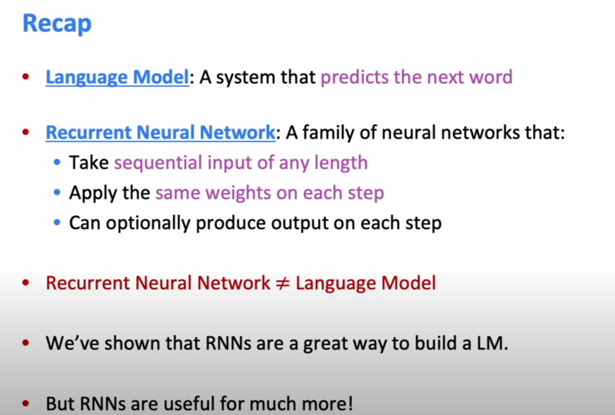
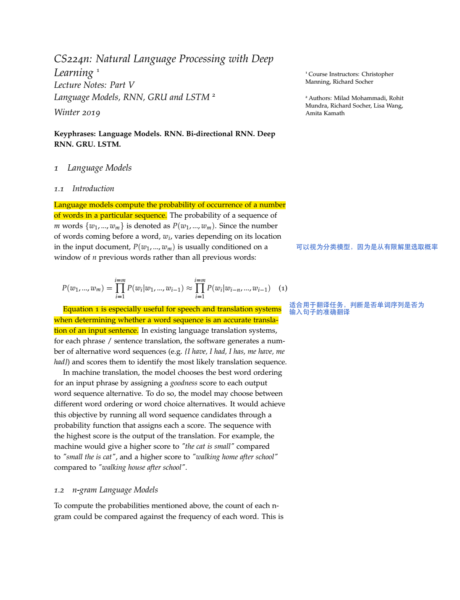
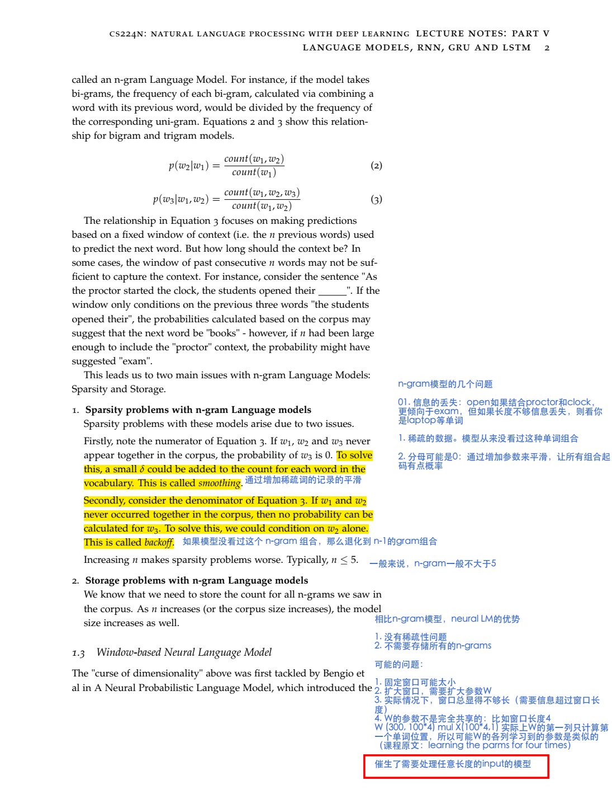
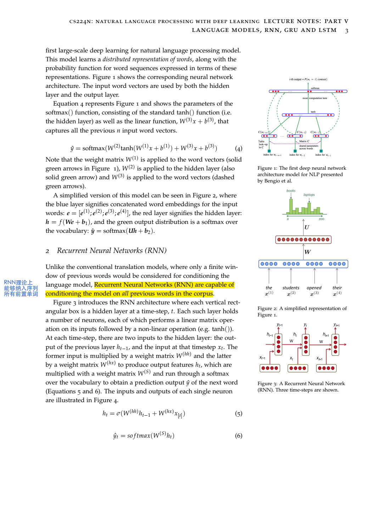
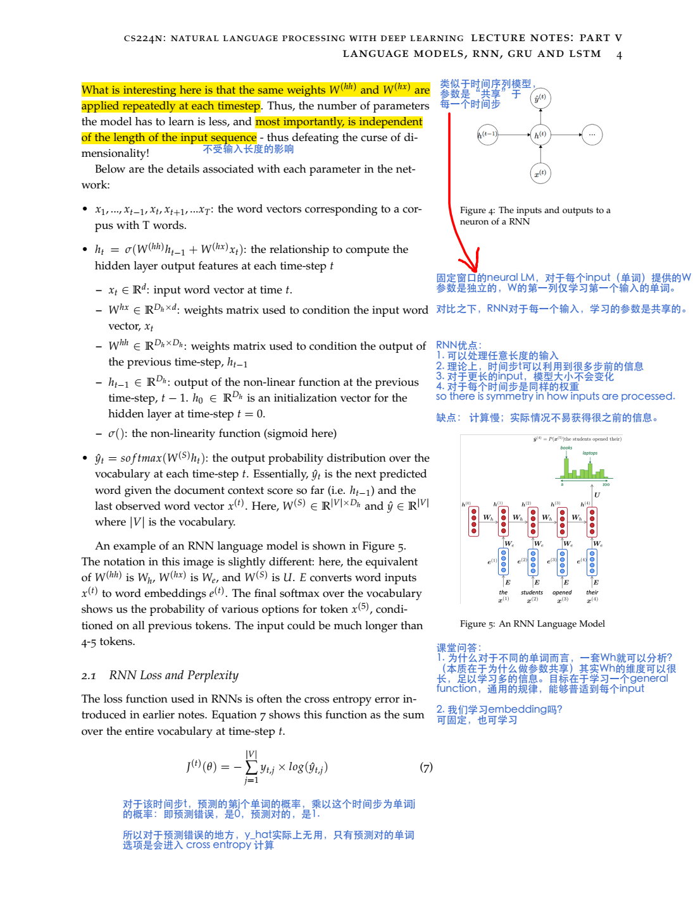
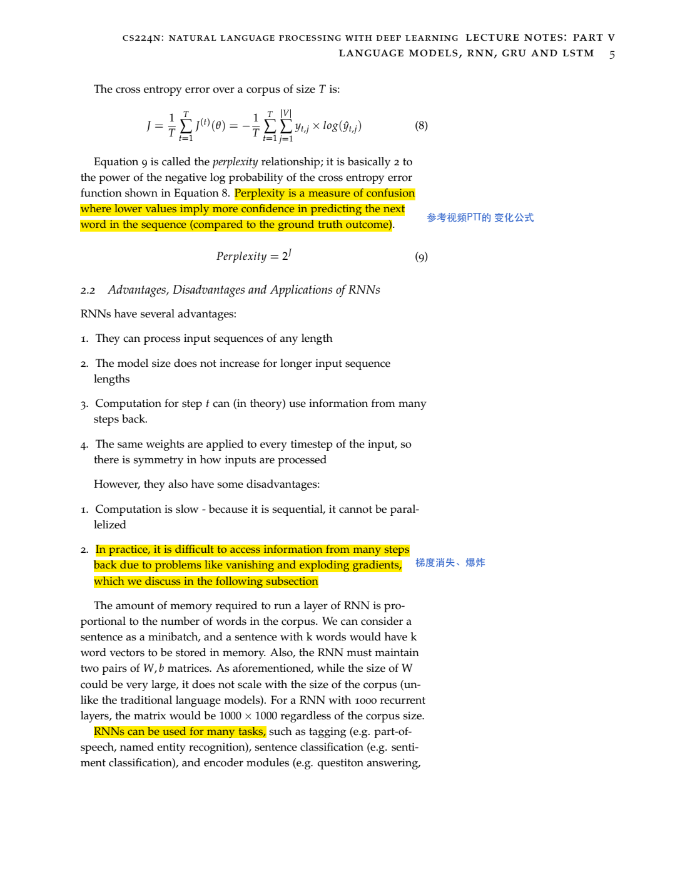

# notes 05 LM and RNN
 
- 课件：http://web.stanford.edu/class/cs224n/readings/cs224n-2019-notes05-LM_RNN.pdf
- youtube: https://youtu.be/iWea12EAu6U
- 2022ppt:http://web.stanford.edu/class/cs224n/slides/cs224n-2022-lecture05-rnnlm.pdf

## youtube-ppt截图

- 语言模型的定义：给定下一个词的概率，或者这个句子生成的概率

- 语言模型重要性

- perplexity 和 cross entropy的关系 

- RNN 系列显著降低困惑度

- 总结 RNN能够用于：
  - 1 序列标注
  - 2 句子分类（一般使用最后一个hidden state，或者取全部的hidden state做element wise 最大池化或者平均
  - 3 用于encoder模块（比如 问答、翻译）作为问题的encoder，来代表问题，是更大神经网络的一部分
  - 4 生成模型

## 课件笔记

## RNN的梯度计算推导

https://d2l.ai/chapter_recurrent-neural-networks/bptt.html

解决梯度爆炸/消失问题：

- 切断部分：计算h_t的梯度时，到t-π 就停止往前回溯累加计算该梯度，仅求近似（9.7.1.2. Truncating Time Steps）
- 随机截断：9.7.1.3. Randomized Truncation
