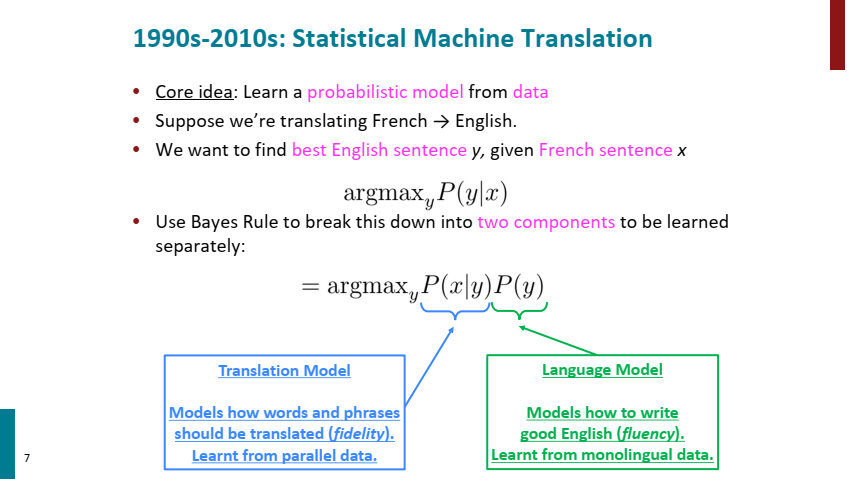
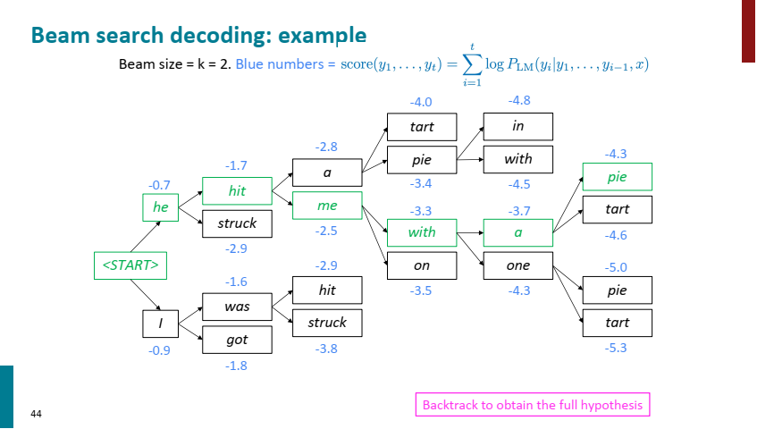
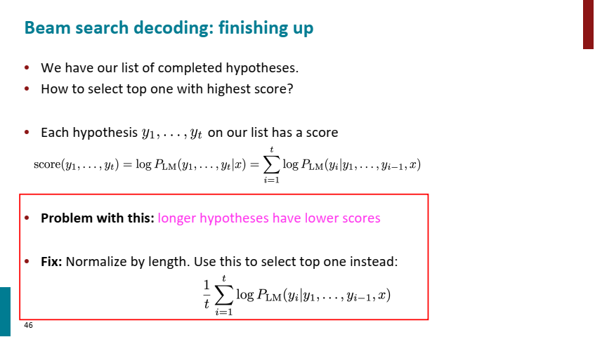
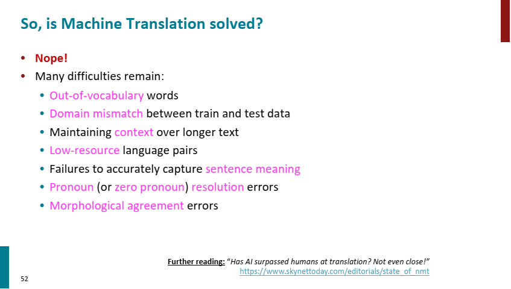
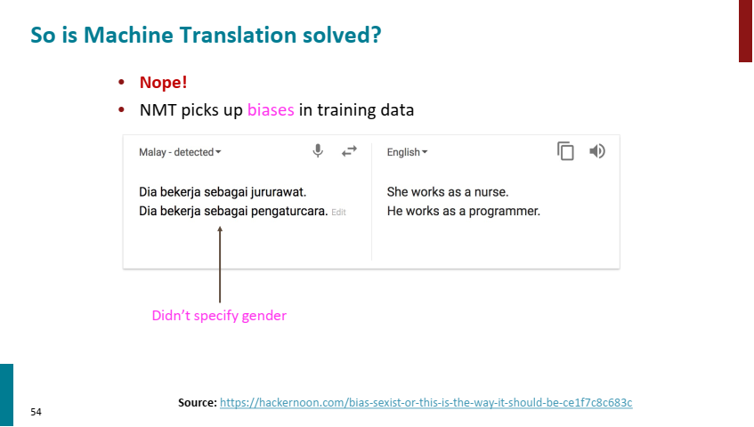
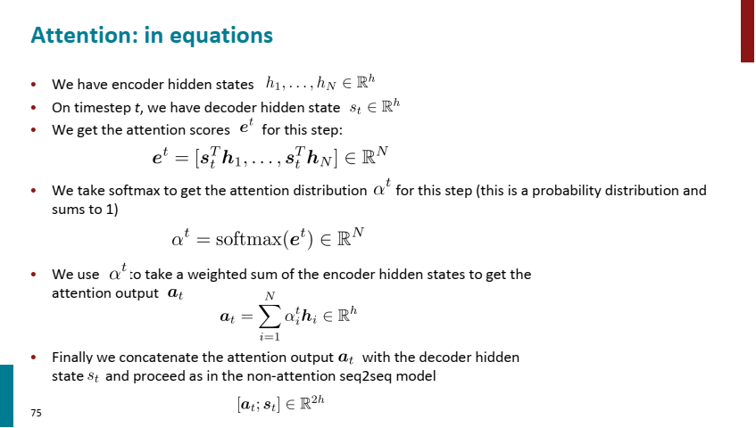

# cs224n-2019-notes06-NMT_seq2seq_attention

## 课件
- 课件：http://web.stanford.edu/class/cs224n/readings/cs224n-2019-notes06-NMT_seq2seq_attention.pdf
- PPT：http://web.stanford.edu/class/cs224n/slides/cs224n-2022-lecture07-nmt.pdf
- youtube
    - Lecture 8 – Translation, Seq2Seq, Attention: https://youtu.be/XXtpJxZBa2c

## PPT

beam search 的问题，越长的假设序列，分数会更低，所以需要归一化。

存在的问题：

- 未登录词
- 训练集和测试集的分布差异
- 长文本的上下文信息维护
- 语言对的训练集缺少
- 缺少对句子的含义精确翻译

模型带有原语言的分布偏差

Attention的方程式

## 参考文献

### 参考1： seq-to-seq 翻译任务
[2014-Sequence to Sequence Learning with Neural Networks](https://arxiv.org/abs/1409.3215)

深度神经网络 (DNN) 是强大的模型，在困难的学习任务上取得了出色的性能。尽管只要有大型标记训练集可用，DNN 就可以很好地工作，但它们不能用于将序列映射到序列。
在本文中，我们提出了一种通用的端到端序列学习方法，该方法对序列结构做出了最小的假设。
我们的方法使用多层长短期记忆 (LSTM) 将输入序列映射到固定维度的向量，然后使用另一个深度 LSTM 从向量中解码目标序列。
我们的主要结果是，在 WMT'14 数据集的英语到法语翻译任务中，LSTM 生成的翻译在整个测试集上的 BLEU 得分为 34.8，`其中 LSTM 的 BLEU 得分因词汇外而受到惩罚字。`
此外，LSTM 在长句上没有困难。相比之下，基于短语的 SMT 系统在同一数据集上的 BLEU 得分为 33.3。
当我们使用 LSTM 对上述 SMT 系统产生的 1000 个假设进行重新排序时，其 BLEU 分数提高到 36.5，接近该任务之前的最佳结果。 
LSTM 还学习了对词序敏感并且对主动和被动语态相对不变的明智的短语和句子表示。
`最后，我们发现反转所有源句子（但不是目标句子）中的单词顺序显着提高了 LSTM 的性能，因为这样做会在源句子和目标句子之间引入许多短期依赖关系，从而使优化问题变得更容易。`
> Deep Neural Networks (DNNs) are powerful models that have achieved excellent performance on difficult learning tasks. Although DNNs work well whenever large labeled training sets are available, they cannot be used to map sequences to sequences. In this paper, we present a general end-to-end approach to sequence learning that makes minimal assumptions about the sequence structure. Our method uses a multilayered Long Short-Term Memory (LSTM) to map the input sequence to a vector of fixed dimensionality, and then another deep LSTM to decode the target sequence from the vector. Our main result is that on an English to French translation task from the WMT'14 dataset, the translations produced by the LSTM achieve a BLEU score of 34.8 on the entire test set, where the LSTM's BLEU score was penalized on out-of-vocabulary words. Additionally, the LSTM did not have difficulty with long sentences. For comparison, a phrase-based SMT system achieves a BLEU score of 33.3 on the same dataset. When we used the LSTM to rerank the 1000 hypotheses produced by the SMT mentioned above system, its BLEU score increased to 36.5, which is close to the previous best result on this task. The LSTM also learned sensible phrase and sentence representations that are sensitive to word order and are relatively invariant to the active and the passive voice. Finally, we found that reversing the order of the words in all source sentences (but not target sentences) improved the LSTM's performance markedly, because doing so introduced many short-term dependencies between the source and the target sentence which made the optimization problem easier.

### 参考2：rnn 搭配 attention

[2016-Neural Machine Translation by Jointly Learning to Align and Translate](https://arxiv.org/abs/1409.0473)

