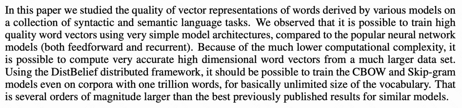

Efficient-Estimation-of-Word-Representations-in-Vector-Space
---

paper: https://arxiv.org/pdf/1301.3781.pdf

---
# Content 目录
1. Introduction
- 1.1 Goals of the paper
- 1.2 Previous work
2. Model architectures
- 2.1 Feedforward neural network net language model (NNLM)
- 2.2 Recurrent neural net language model (RNNLM)
- 2.3 Parallel training of neural network
3. New log-linear model 
- 3.1 Continuous bag-of-words model
- 3.2 Continuous skip-gram model
4. Results
- 4.1 Task description
- 4.2 Maximization of accuracy
- 4.3 Comparison of model architectures
- 4.4 Large scale parallel training of models
- 4.5 Microsoft research sentence completion challenge
5. Examples of the learned relationships
6. Conclusion
7. Follow-up work

---
摘要
- 提出了两个模型，用于从非常大的数据集中计算单词的连续向量表示
- 效果检测：（1）词汇相似性 （2）与过往的神经网络模型相比
- 高准确、更低成本（用不到一天的时间从 16 亿个单词中学习高质量的词向量）
- 我们表明这些向量在我们的测试集上提供了最先进的性能，用于测量句法(syntactic)和语义词(semantic)的相似性

# 1. Introduction

介绍了现状
- 当下（2013年）很多模型将单个词汇视为最小单元，没有体现单词之间的相关性(因为在词汇表里呈现为index)
    - 具备一定合理性：模型简洁、稳定性、能够在很大的数据集
    - N-gram模型是一个很好的例子，理论上可以训练数据全集（trillions of words）
    
- 这样简洁的模型依旧有局限
    - 由于需要大量数据，比如语音识别这种数据集较小的领域应用不佳
    - 因此，用简易的技术堆积并非能够带来巨大改进
    
- 最佳构想是对词的表示，比如神经网络模型优于N-gram模型

## 1.1 Goals of the paper
- 本文主要目的：
    - 从巨大数据集（数十亿的词、数百万的词汇量）之中构造高质量的词汇向量表示
    - 对比现状：大部分现存的技术，只能够处理数千万的词、单词向量的modest维度只有50-100

- 词汇向量表示的质量 - 近期技术 [[20]](#20):
    - 相似词汇更加相近
    - 词汇有不同的相似程度（可区分、衡量）
    - 在 context of inflectional languages 已有体现——一个名词会有多个结尾词，一般从原有的向量空间里找类似词汇，也可以找到类似的结尾词
    
- 词汇的表示的相似度并不止于（1）简单的词汇含义/语法相似，还有（2）词向量的计算：$vector("king") - vector("man") + vector("woman)$ 约等于 $vector("queen")$ —— 相当于空间上向量之间的关系


```In this paper, we try to maximize accuracy of these vector operations by developing new model architectures that preserve the linear regularities among words. We design a new comprehensive test set for measuring both syntactic and semantic regularities1, and show that many such regularities can be learned with high accuracy. Moreover, we discuss how training time and accuracy depends on the dimensionality of the word vectors and on the amount of the training data.```

## 1.2 Previous work
- NNLM：线性映射层 以及 非线性隐藏层 被用于学习 词向量表示以及统计性语言模型
- 词向量能够显著提升并且简化 NLP 应用。
- 但现有的技术，计算量太复杂

# 2. Model architectures

有很多模型应用于词表示：包括了 Latent Semantic Analysis (LSA) 和 Latent Dirichlet Allocation (LDA)

本文主要做 词的分布式表示 (distributed representations of words) 
- 应用神经网络优于LSA：在保持词汇之间的线性规则 (linear regularities)
- LDA在大数据集上计算复杂度过高

为了对比模型: 1. 模型的参数个数 2.提升准确率，同时保持较低的计算复杂度

因此，模型的训练复杂度以该比例增长： O = E × T × Q，所有模型应用梯度随机下降以及反向传播算法。
- E: 训练epoch数，一般是 3～50
- T: 训练集的词汇数，可达到十亿级别(billions)
- Q: 模型的自定义参数


## 2.1 Feedforward neural network net language model (NNLM)

NNLM 应用于 [[1]](#1)

$y = b + WX + U tanh(d + hX)$


# 6. Conclusion


- 本文中的主要工作：在一系列的质量句法和语义语言任务(syntactic and semantic language tasks)上，研究了不同模型下的词向量表示的质量。

- 模型架构相对简单，提升计算速度，从而纳入了更多的训练样本。
    - 由于计算复杂度低得多，可以从更大的数据集中计算出非常准确的高维词向量
    - 与NNLM、RNNLM对比（文中的第2章）
    
- 应用DistBelief 分布式框架：训练 CBOW 和 Skip-gram，即使在具有一万亿个单词的语料库上也可以建模，基本上是无限大小的词汇表


<a id="1">[1]</a>
Y. Bengio, R. Ducharme, P. Vincent. A neural probabilistic language model. Journal of Machine Learning Research, 3:1137-1155, 2003.
-- https://www.jmlr.org/papers/volume3/bengio03a/bengio03a.pdf

<a id="20">[20]</a> 
T. Mikolov, W.T. Yih, G. Zweig. Linguistic Regularities in Continuous Space Word Representations. NAACL HLT 2013.
