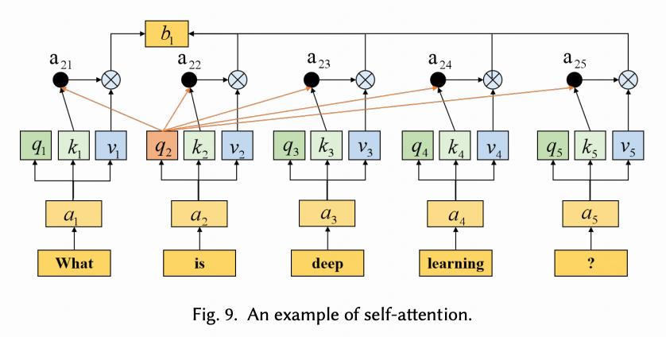

A Survey on Text Classification: From Shallow to Deep Learning

https://arxiv.org/pdf/2008.00364v2.pdf

# Abstract 

> Text classification is the most fundamental and essential task in natural language processing. The last decade has seen a surge of research in this area due to the unprecedented success of deep learning. Numerous methods, datasets, and evaluation metrics have been proposed in the literature, raising the need for a comprehensive and updated survey. This paper fills the gap by reviewing the state of the art approaches from 1961 to 2020, focusing on models from shallow to deep learning. We create a taxonomy for text classification according to the text involved and the models used for feature extraction and classification. We then discuss each of these categories in detail, dealing with both the technical developments and benchmark datasets that support tests of predictions. A comprehensive comparison between different techniques, as well as identifying the pros and cons of various evaluation metrics are also provided in this survey. Finally, we conclude by summarizing key implications, future research directions, and the challenges facing the research area.
> 
> 文本分类是自然语言处理中最基本、最本质的任务。由于深度学习的空前成功，过去十年在这一领域的研究激增。文献中提出了许多方法、数据集和评估指标，因此需要进行全面和更新的调查。本文通过回顾 1961 年至 2020 年的最先进方法来填补这一空白，重点关注从浅层学习到深度学习的模型。我们根据所涉及的文本以及用于特征提取和分类的模型创建文本分类的分类法。然后，我们详细讨论这些类别中的每一个，处理支持预测测试的技术发展和基准数据集。本次调查还提供了不同技术之间的全面比较，以及确定各种评估指标的优缺点。最后，我们总结了关键意义、未来研究方向和研究领域面临的挑战。

# Introduction 

几类应用（文中附文献）：
- 情感分析
- 主题学习
- QA
- 对话行为分类 (dialog act classification)

> sentiment analysis[1][2] [3], topic labeling [4] [5] [6], question answering [7] [8] and dialog act classification [9]

信息爆炸的背景下，手动提取信息存在局限（数据量太大，准确率依赖于人类因素水平）；
而浅层模型依赖于特征提取，我们希望通过深度模型来通过非线性变换来自动学习特征提取，并且建立输入和输出的映射。

从Fig.2 能够看到浅层、深层模型的发展
- 1960 - 2010：主要以朴素贝叶斯、k近邻、SVM等方法，相对于早前的规则类方法，准确率和稳定性提升了
- 2010～ ：文本分类从浅层转为深层模型


## 1.1 Major Differences and Contributions

- table1：展示了经典模型以及应用
- table2：主要模型的设计、评估指标、实际数据
- table3：实际应用数据
- table5：在基准数据集上的分类准确率

## 2.2 Deep Learning Models

### 2.2.1 ReNN-based Methods
### 2.2.2 MLP-based Methods
### 2.2.3 RNN-based Methods

RNN, topic-RNN

为了解决RNN的梯度灾难问题，以及长期记忆问题: LSTM

> 递归神经网络（RNN）由于通过递归计算捕获远程依赖而被广泛使用。 RNN 语言模型学习历史信息，考虑所有适合文本分类任务的单词之间的位置信息。 我们用一个简单的样本展示了一个用于文本分类的 RNN 模型，如图 7 所示。首先，每个输入词使用词嵌入技术由一个特定的向量表示。 然后，嵌入的词向量被一个一个地输入 RNN 单元。 RNN 单元的输出与输入向量的维度相同，并被馈送到下一个隐藏层。 RNN 在模型的不同部分共享参数，并且每个输入词具有相同的权重。 最后，输入文本的标签可以通过隐藏层的最后一个输出来预测
>
> 为了降低模型的时间复杂度并捕获上下文信息，Liu 等人。 [48] 介绍了一种用于捕获长文本语义的模型。它逐个解析文本，是一个有偏见的模型，使得后续输入比前者更有利，并降低了捕获整个文本的语义效率。为了对具有长输入序列的主题标记任务进行建模，提出了 TopicRNN [57]。它通过潜在主题捕获文档中单词的依赖关系，并使用 RNN 捕获局部依赖关系和潜在主题模型以捕获全局语义依赖关系。虚拟对抗训练（VAT）[141]是一种适用于半监督学习任务的有用正则化方法。宫藤等人。 [55]将对抗性和虚拟对抗性训练应用于文本字段，并将扰动应用于词嵌入而不是原始输入文本。该模型提高了词嵌入的质量，并且在训练过程中不易过拟合。胶囊网络[142]使用胶囊之间的动态路由来捕获特征之间的关系，该胶囊由一层中的一组神经元组成。
> 
> 在 RNN 的反向传播过程中，权重通过梯度进行调整，通过导数的连续乘法计算得出。如果导数非常小，可能会通过连续乘法导致梯度消失问题。长短期记忆（LSTM）[143]，RNN 的改进，有效缓解了梯度消失问题。它由一个用于记住任意时间间隔的值的单元和三个用于控制信息流的门结构组成。门结构包括输入门、遗忘门和输出门。 LSTM分类方法可以更好地捕捉上下文特征词之间的联系，利用遗忘门结构过滤无用信息，有利于提高分类器的总捕捉能力。 Tree-LSTM [2] 将 LSTM 模型的序列扩展到树结构。通过Tree-LSTM模型的LSTM遗忘门机制，对结果影响不大的整个子树可以被遗忘。

### 2.2.4 CNN-based Methods

- CNN
    - 源自于图像分类任务，不同于RN，使用不同核的卷积来应用序列的多个块，CNN多用于文本分类。
    - 过程：文本的词向量拼接为矩阵，不同维度的filter对矩阵进行卷积，形成卷积层结果。喂入池化层，将池化结果拼接，最终得到文本的向量表示。使用向量进行分类。
- TextCNN：CNN的改进版本，最大池化层来找到决定性的信息，从而更好地分类；让词向量保持静态来学习其他参数。
- 双视图半监督CNN（CNN model based on two-view semi-supervised learning）
- 深度金字塔卷积神经网络（DPCNN, deep pyramid convolutional neural network）

```
根据文本的最小嵌入单元，嵌入方法分为字符级、词级和句子级嵌入。
- 字符级：解决词汇表外 (OOV) 单词问题
- 词级：学习词的语义（含义）及语法关系（单复数、动词变形等）
- 句子级：捕获句子间关系
```
- 亚当斯等人 [122] 提出了一个`字符级`的 CNN 模型，称为 MGTC，用于对编写的多语言文本进行分类。 

基于 RNN 的模型捕获序列信息以学习输入单词之间的依赖关系，基于 CNN 的模型从卷积核中提取相关特征。 因此，一些作品研究了这两种方法的融合:
- BLSTM-2DCNN [118]：将双向 LSTM (BiLSTM) 与二维最大池化相结合。 它使用 2D 卷积来采样矩阵的更有意义的信息，并通过 BiLSTM 更好地理解上下文。
- META：是 BiLSTM 和 CNN 层的组合，用于解决方面类别分类和方面术语提取任务。
> 卷积神经网络 (CNNs) 被提出用于图像分类，使用可以提取图片特征的卷积滤波器。 与 RNN 不同，CNN 可以同时将不同内核定义的卷积应用于序列的多个块。 因此，CNN 被用于许多 NLP 任务，包括文本分类。 对于文本分类，需要将文本表示为类似于图像表示的向量，并且可以从多个角度过滤文本特征，如图7所示。首先，将输入文本的词向量拼接成一个矩阵。 然后将矩阵馈入卷积层，该层包含几个不同维度的过滤器。 最后，卷积层的结果经过池化层，将池化结果连接起来，得到文本的最终向量表示。 类别由最终向量预测。
> 
> 为了尝试将 CNN 用于文本分类任务，Kim 引入了一种无偏的卷积神经网络模型，称为 TextCNN [18]。它可以通过一层卷积更好地确定最大池化层中的判别短语，并通过保持词向量静态来学习除词向量之外的超参数。对于数据驱动的深度模型，仅对标记数据进行训练是不够的。因此，一些研究人员考虑使用未标记的数据。约翰逊等人。 [145] 提出了一种基于双视图半监督学习的文本分类 CNN 模型，该模型首先使用未标记的数据来训练文本区域的嵌入，然后是标记的数据。 DNN 通常具有更好的性能，但它增加了计算复杂度。受此启发，提出了一种深度金字塔卷积神经网络（DPCNN）[59]，通过提高网络深度来提高计算精度。 DPCNN 比 ResNet [146] 更具体，因为所有快捷方式都是简单的身份映射，没有任何维度匹配的复杂性
>
> 根据文本的最小嵌入单元，嵌入方法分为字符级、词级和句子级嵌入。 字符级嵌入可以解决词汇表外 (OOV) 单词。 词级嵌入学习词的语法和语义。 此外，句子级嵌入可以捕获句子之间的关系。 受这些激励，Nguyen 等人。 [147] 提出了一种基于字典的深度学习方法，通过构建语义规则和深度 CNN 为字符级嵌入增加单词级嵌入的信息。 亚当斯等人。 [122] 提出了一个字符级的 CNN 模型，称为 MGTC，用于对编写的多语言文本进行分类。 提出 TransCap [148] 将句子级语义表示封装到语义胶囊中并传递文档级知识。
> 
> 基于 RNN 的模型捕获序列信息以学习输入单词之间的依赖关系，基于 CNN 的模型从卷积核中提取相关特征。 因此，一些作品研究了这两种方法的融合。 BLSTM-2DCNN [118] 将双向 LSTM (BiLSTM) 与二维最大池化相结合。 它使用 2D 卷积来采样矩阵的更有意义的信息，并通过 BiLSTM 更好地理解上下文。 此外，薛等人。 [149] 提出了 MTNA，它是 BiLSTM 和 CNN 层的组合，用于解决方面类别分类和方面术语提取任务。

### 2.2.5 Attention-based Methods

CNN 和 RNN 由于不可视的hidden data而缺乏可解释性，特别是在分类错误当中。因此注意力机制成功应用于文本分类。

第1段：两个先驱：

Bahdanau et al. [150] 首先应用注意力机制于机器翻译。
>D. Bahdanau, K. Cho, and Y. Bengio, “Neural machine translation by jointly learning to align and translate,” in 3rd
International Conference on Learning Representations, ICLR 2015, San Diego, CA, USA, May 7-9, 2015, Conference Track
Proceedings, 2015.

Yang et al. [46] hierarchical attention network (HAN) 
模型包括了两个encoders 和 两层注意力层。注意力机制让模型对特定输入给予不同的注意力。将关键词积聚到句子向量，再把关键句子向量积聚到整体文本（文章）向量中。能够学习每个词、句子对分类判断的贡献度。

第2段：注意力机制能够提升文本分类时的解释性

LSTMN [50], 从左到右逐步处理文本，进行表层推理（superficial reasoning）

Wang et al. [151]， attention-based LSTM 研究 aspects 和输入句子之间的关系（句子类型判断？）

BI-Attention [125]，跨语种文本分类，捕捉长距离依赖

第3段

Self-attention [153] (Attention is all you need)。
在句子中将词语的权重分布，通过构建K、Q、V矩阵来计算。
对于输入的单词向量 $a_i$ 可以表示为三个n维向量，包括 $q_i$, $k_i$, $v_i$. 
在self-attention之后，输出的向量 $b_i$ 表示为 $\sum_j softmax(a_{ij}) v_j$, where $a_{ij} = q_i \dot k_j / \sqrt{n}$
所有的输出向量可以并行计算.



> Self-attention [153] captures the weight distribution of words in sentences by constructing K, Q and V matrices among sentences that can capture long-range dependencies on text classification. We give an example for self-attention, as shown in Fig. 9. 
> Each input word vector ai can be represented as three n-dimensional vectors, including qi , ki and vi . 
> After self-attention, the output vector bi can be represented as  j softmax(aij)vj and aij = qi · kj / √ n. All output vectors can be parallelly computed.